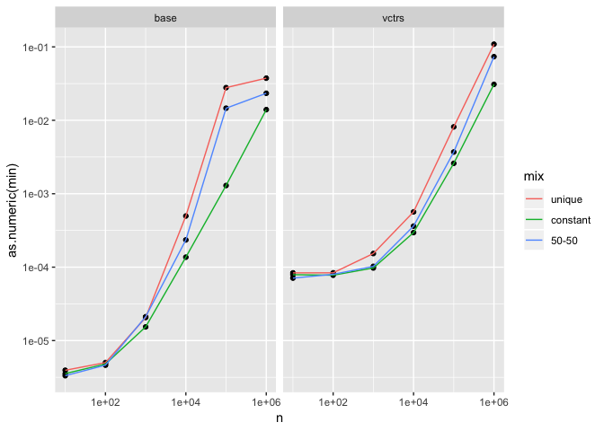
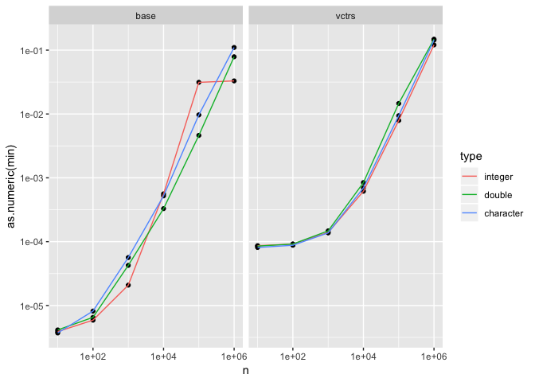
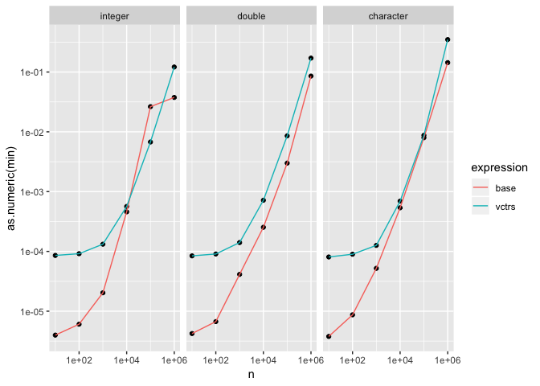
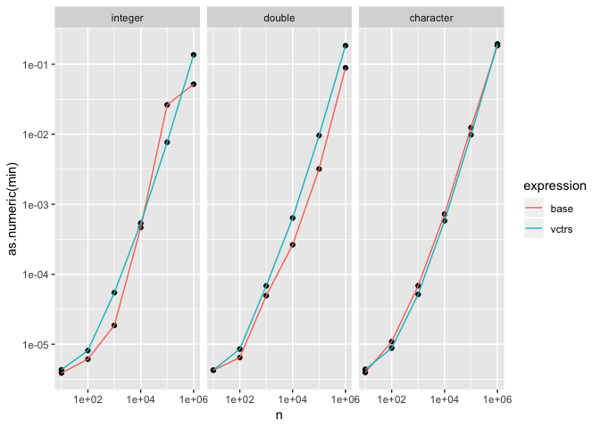

Dictionary performance
================

``` r
library(tidyverse)
library(vctrs)

make_vec <- function(type, n, mix) {
  x <- switch(as.character(mix),
    unique = 1:n,
    constant = rep(0L, n),
    "50-50" = c(1:(n/2), rep(0L, n / 2))
  )
  
  as.vector(x, as.character(type))
}
```

## Proportion of uniqueness

``` r
df <- bench::press(
  n = c(1e1, 1e2, 1e3, 1e4, 1e5, 1e6),
  mix = c("unique", "constant", "50-50"),
  {
    x <- make_vec("integer", n, mix)
    bench::mark(
      base = unique(x),
      vctrs = vec_unique(x),
      min_time = 0.05
    )
  }
)
#>  Running with:
#>           n mix
#>   1      10 unique
#>   2     100 unique
#>   3    1000 unique
#>   4   10000 unique
#>   5  100000 unique
#>   6 1000000 unique
#>  Warning: Some expressions had a GC in every iteration; so filtering is
#>  disabled.
#>   7      10 constant
#>   8     100 constant
#>   9    1000 constant
#>  10   10000 constant
#>  11  100000 constant
#>  12 1000000 constant
#>  Warning: Some expressions had a GC in every iteration; so filtering is
#>  disabled.
#>  13      10 50-50
#>  14     100 50-50
#>  15    1000 50-50
#>  16   10000 50-50
#>  17  100000 50-50
#>  18 1000000 50-50
#>  Warning: Some expressions had a GC in every iteration; so filtering is
#>  disabled.
```

Relatively small difference. Unsurprisingly, unique is the worst case,
so I’ll just only use that going forward.

<!-- -->

## Performance by type

``` r
df <- bench::press(
  type = c("integer", "double", "character"),
  n = c(1e1, 1e2, 1e3, 1e4, 1e5, 1e6),
  {
    x <- make_vec(type, n, "unique")
    bench::mark(
      base = unique(x),
      vctrs = vec_unique(x),
      min_time = 0.05,
      max_iterations = 20
    )
  }
)
#>  Running with:
#>     type            n
#>   1 integer        10
#>   2 double         10
#>   3 character      10
#>   4 integer       100
#>   5 double        100
#>   6 character     100
#>   7 integer      1000
#>   8 double       1000
#>   9 character    1000
#>  10 integer     10000
#>  11 double      10000
#>  12 character   10000
#>  13 integer    100000
#>  14 double     100000
#>  15 character  100000
#>  16 integer   1000000
#>  Warning: Some expressions had a GC in every iteration; so filtering is
#>  disabled.
#>  17 double    1000000
#>  Warning: Some expressions had a GC in every iteration; so filtering is
#>  disabled.
#>  18 character 1000000
#>  Warning: Some expressions had a GC in every iteration; so filtering is
#>  disabled.
```

Let’s compare head-to-head with base:

<!-- -->

Clearly there’s some larger setup cost needed for vctrs dictionary, and
the performance difference declines as size increases.

<!-- -->

## Raw C code

If we just call the C function that underlies `vec_unique()`,
(i.e. ignoring the code that makes these functions generic), we see
basically no performance difference:

``` r
df <- bench::press(
  type = c("integer", "double", "character"),
  n = c(1e1, 1e2, 1e3, 1e4, 1e5, 1e6),
  {
    x <- make_vec(type, n, "unique")
    bench::mark(
      base = unique(x),
      vctrs = .Call(vctrs:::vctrs_unique_loc, x),
      min_time = 0.05,
      max_iterations = 20,
      check = FALSE
    )
  }
)
#>  Running with:
#>     type            n
#>   1 integer        10
#>   2 double         10
#>   3 character      10
#>   4 integer       100
#>   5 double        100
#>   6 character     100
#>   7 integer      1000
#>   8 double       1000
#>   9 character    1000
#>  10 integer     10000
#>  11 double      10000
#>  12 character   10000
#>  13 integer    100000
#>  14 double     100000
#>  15 character  100000
#>  16 integer   1000000
#>  Warning: Some expressions had a GC in every iteration; so filtering is
#>  disabled.
#>  17 double    1000000
#>  Warning: Some expressions had a GC in every iteration; so filtering is
#>  disabled.
#>  18 character 1000000
#>  Warning: Some expressions had a GC in every iteration; so filtering is
#>  disabled.

ggplot(df, aes(n, as.numeric(min))) + 
  geom_point() + 
  geom_line(aes(colour = expression)) + 
  scale_x_log10() + 
  scale_y_log10() + 
  facet_wrap(~ type)
```

<!-- -->
