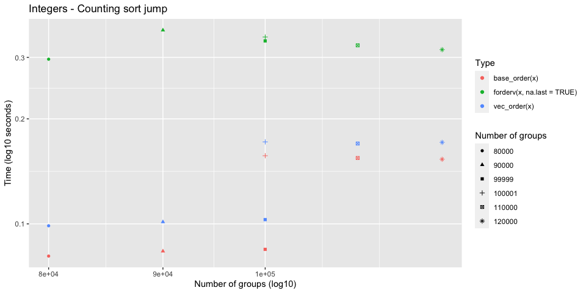
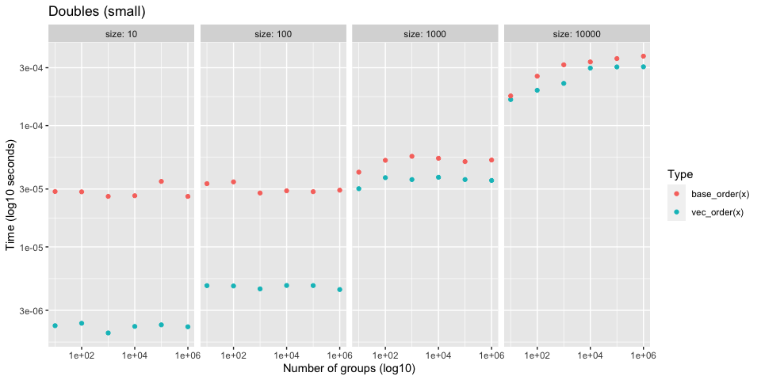
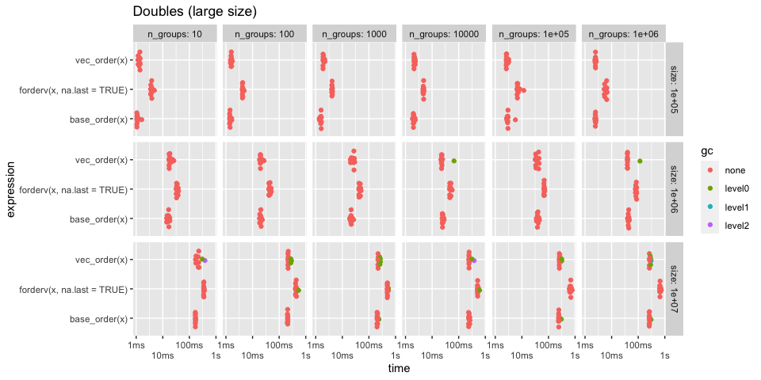

Order performance
================

Investigation of `vec_order()` performance compared with `base::order()`
using various data types and distributions of data (total size, number
of groups, etc).

## Setup

``` r
library(vctrs)
library(rlang)
library(stringr)
library(ggplot2)
library(dplyr)
library(forcats)
```

``` r
# Wrapper around `order()` that is also meaningful for data frames and
# always chooses radix ordering
base_order <- function(x, na.last = TRUE, decreasing = FALSE) {
  if (is.data.frame(x)) {
    x <- unname(x)
  } else {
    x <- list(x)
  }

  args <- list(na.last = na.last, decreasing = decreasing, method = "radix")

  args <- c(x, args)

  exec("order", !!!args)
}
```

``` r
# Generate `size` random words of varying string sizes
new_dictionary <- function(size, min_length, max_length) {
  lengths <- rlang::seq2(min_length, max_length)

  stringi::stri_rand_strings(
    size,
    sample(lengths, size = size, replace = TRUE)
  )
}
```

``` r
# Work around bench_expr bug where vectorized attribute isn't being sliced
# https://github.com/r-lib/bench/pull/90

filter_bench <- function(.data, ...) {
  out <- dplyr::mutate(.data, rn = row_number()) %>%
    dplyr::filter(...)
  
  # patch up bench_expr
  which <- out$rn
  desc <- attr(.data$expression, "description")
  attr(out$expression, "description") <- desc[which]
  
  out$rn <- NULL
  
  out
}
```

``` r
plot_bench <- function(df, title = waiver()) {
  df %>%
    ggplot(aes(x = n_groups, y = as.numeric(median))) +
    geom_point(aes(color = as.character(expression))) +
    facet_wrap(~ size, labeller = label_both, nrow = 1) +
    scale_x_log10() +
    scale_y_log10() + 
    labs(
      x = "Number of groups (log10)",
      y = "Time (log10 seconds)",
      color = "Type",
      title = title
    )
}
```

## Integers

The performance of integer sorting is generally the same as `order()`.
The one exception is with nearly sorted integer vectors, where `order()`
does better for some unknown reason. See the “Nearly sorted sequence”
section.

### Test 1

  - Varying total size (small)
  - Varying group size

<!-- end list -->

``` r
set.seed(123)

size <- 10 ^ (1:4)
n_groups <- 10 ^ (1:6)

df <- bench::press(
  size = size,
  n_groups = n_groups,
  {
    x <- sample(n_groups, size, replace = TRUE)
    bench::mark(vec_order(x), base_order(x), iterations = 50)
  }
)
```

We seem to have a small edge when ordering very small vectors, but this
practically won’t make too much of a difference.

<!-- -->

### Test 2

  - Varying total size (large)
  - Varying number of groups

<!-- end list -->

``` r
set.seed(123)

size <- 10 ^ (5:7)
n_groups <- 10 ^ (1:6)

df <- bench::press(
  size = size,
  n_groups = n_groups,
  {
    x <- sample(n_groups, size, replace = TRUE)
    bench::mark(vec_order(x), base_order(x), iterations = 10)
  }
)
```

Performance seems to be generally about the same no matter the size or
number of groups.

<!-- -->

### Test 3

Investigating the performance of switching from the counting sort to the
radix sort. This happens at `INT_COUNTING_ORDER_RANGE_BOUNDARY` which is
100,000.

``` r
set.seed(123)

n_groups <- c(80000, 90000, 99999, 100001, 110000, 120000)
size <- 1e7

df <- bench::press(
  n_groups = n_groups,
  {
    x <- sample(n_groups, size, replace = TRUE)
    bench::mark(vec_order(x), base_order(x), iterations = 20)
  }
)
```

There is a definite jump in performance when initially moving to the
counting sort. Perhaps this boundary isn’t optimal, but it seems to
scale well after the boundary.

``` r
df
#>  # A tibble: 12 x 7
#>     expression    n_groups      min   median `itr/sec` mem_alloc `gc/sec`
#>     <bch:expr>       <dbl> <bch:tm> <bch:tm>     <dbl> <bch:byt>    <dbl>
#>   1 vec_order(x)     80000  105.7ms    115ms      8.59    38.1MB    0.954
#>   2 base_order(x)    80000   91.9ms    110ms      9.28    38.1MB    1.03 
#>   3 vec_order(x)     90000  119.2ms    129ms      7.52    38.1MB    1.88 
#>   4 base_order(x)    90000  109.5ms    117ms      8.43    38.1MB    1.49 
#>   5 vec_order(x)     99999  115.1ms    136ms      7.27    38.1MB    0.808
#>   6 base_order(x)    99999  102.6ms    118ms      8.49    38.1MB    0.944
#>   7 vec_order(x)    100001  173.4ms    175ms      5.65   162.1MB    3.77 
#>   8 base_order(x)   100001  165.9ms    172ms      5.78    38.1MB    0.642
#>   9 vec_order(x)    110000  172.4ms    176ms      5.67   162.1MB    4.64 
#>  10 base_order(x)   110000  167.4ms    171ms      5.80    38.1MB    0.644
#>  11 vec_order(x)    120000  173.5ms    184ms      5.44   162.1MB    2.33 
#>  12 base_order(x)   120000  166.6ms    174ms      5.73    38.1MB    0.302
```

<!-- -->

## Doubles

Double performance is overall similar to integers when compared with
`order()`. It is generally slower than ordering integers because a
maximum of 8 passes are required to order a double (8 bytes vs 4 bytes
in integers).

### Test 1

  - Varying total size (small)
  - Varying group size

<!-- end list -->

``` r
set.seed(123)

size <- 10 ^ (1:4)
n_groups <- 10 ^ (1:6)

df <- bench::press(
  size = size,
  n_groups = n_groups,
  {
    x <- sample(n_groups, size, replace = TRUE) + 0
    bench::mark(vec_order(x), base_order(x), iterations = 50)
  }
)
```

Performance is about the same.

<!-- -->

### Test 2

  - Varying total size (large)
  - Varying number of groups

<!-- end list -->

``` r
set.seed(123)

size <- 10 ^ (5:7)
n_groups <- 10 ^ (1:6)

df <- bench::press(
  size = size,
  n_groups = n_groups,
  {
    x <- sample(n_groups, size, replace = TRUE) + 0
    
    bench::mark(
      vec_order(x),
      base_order(x),
      iterations = 10
    )
  }
)
```

I imagine the increase in gc’s for large sizes comes from the fact that
`vec_order()` uses `Rf_allocVector()` to generate its working memory,
and `base_order()` uses `malloc()`, which won’t trigger a gc.

<!-- -->

<!-- -->

## Characters

I expect to be slightly slower with character vectors, as base R has
access to macros for `TRUELENGTH()` and `LEVELS()` (used to determine
encoding), but we have to call their function equivalents.

There is also an additional component here, the maximum string length.
The longest string in the vector determines how many “passes” are
required in the radix sort. Longer strings mean more passes which
generally takes more time. However, keep in mind that we only radix sort
the unique strings, so this often doesn’t hurt us that much (like in
dplyr where we group on a character column with just a few groups).

### Test 1

  - Varying total size (small)
  - Varying group size
  - String length of 5-20 characters

<!-- end list -->

``` r
set.seed(123)

size <- 10 ^ (1:4)
n_groups <- 10 ^ (1:6)

df <- bench::press(
  size = size,
  n_groups = n_groups,
  {
    dict <- new_dictionary(n_groups, min_length = 5, max_length = 20)
    x <- sample(dict, size, replace = TRUE)
    bench::mark(vec_order(x), base_order(x), iterations = 50)
  }
)
```

<!-- -->

As expected, for small ish sizes we are somewhat slower. This difference
seems to go away as you increase the number of groups.

``` r
df %>%
  mutate(expression = as.character(expression)) %>%
  filter_bench(size == 10000)
#>  # A tibble: 12 x 8
#>     expression     size n_groups      min   median `itr/sec` mem_alloc `gc/sec`
#>     <chr>         <dbl>    <dbl> <bch:tm> <bch:tm>     <dbl> <bch:byt>    <dbl>
#>   1 vec_order(x)  10000       10 103.22µs 117.94µs     8661.   439.8KB        0
#>   2 base_order(x) 10000       10  76.68µs  77.47µs    12533.    39.1KB        0
#>   3 vec_order(x)  10000      100 122.55µs 135.85µs     7400.   439.8KB        0
#>   4 base_order(x) 10000      100  82.58µs  84.96µs    11551.    39.1KB        0
#>   5 vec_order(x)  10000     1000 192.71µs 205.72µs     4485.   439.8KB        0
#>   6 base_order(x) 10000     1000 161.82µs 165.62µs     5785.    39.1KB        0
#>   7 vec_order(x)  10000    10000   1.45ms   1.77ms      585.   439.8KB        0
#>   8 base_order(x) 10000    10000 659.46µs 749.41µs     1295.    39.1KB        0
#>   9 vec_order(x)  10000   100000 923.07µs  986.5µs      982.   439.8KB        0
#>  10 base_order(x) 10000   100000   1.28ms   1.42ms      681.    39.1KB        0
#>  11 vec_order(x)  10000  1000000   1.12ms   1.37ms      728.   439.8KB        0
#>  12 base_order(x) 10000  1000000   1.71ms   1.83ms      533.    39.1KB        0
```

### Test 2

  - Varying total size (large)
  - Varying number of groups
  - String length of 5-20 characters

<!-- end list -->

``` r
set.seed(123)

size <- 10 ^ (5:7)
n_groups <- 10 ^ (1:6)

df <- bench::press(
  size = size,
  n_groups = n_groups,
  {
    dict <- new_dictionary(n_groups, min_length = 5, max_length = 20)
    x <- sample(dict, size, replace = TRUE)
    bench::mark(vec_order(x), base_order(x), iterations = 10)
  }
)
```

Generally about the same once the size gets larger

<!-- -->

Zoom into the size 1e7 section and change to normal seconds (not log
seconds)

As the number of unique strings increases, we have to radix order more
strings. This generally takes more time.

<!-- -->

### Test 3

Very large set of completely random strings

``` r
set.seed(123)

n_groups <- 1e7

x <- new_dictionary(n_groups, min_length = 5, max_length = 20)

bench::mark(vec_order(x), base_order(x), iterations = 10)
#>  # A tibble: 2 x 6
#>    expression         min   median `itr/sec` mem_alloc `gc/sec`
#>    <bch:expr>    <bch:tm> <bch:tm>     <dbl> <bch:byt>    <dbl>
#>  1 vec_order(x)     5.68s    5.89s     0.165   855.8MB   0.346 
#>  2 base_order(x)    5.81s    5.95s     0.160    38.1MB   0.0160
```

### Test 4

What is the effect of string size on total time?

  - Longer strings generally means more passes are required (one pass
    per character)
  - It is related to number of groups (i.e. number of unique strings) in
    two ways:
      - Only unique strings are sorted
      - As soon as it can tell all strings apart it stops

<!-- end list -->

``` r
set.seed(123)

size <- 1e6

n_groups <- 10 ^ (1:6)
string_size <- c(10, 20, 40, 60, 80, 100)

df <- bench::press(
  string_size = string_size,
  n_groups = n_groups,
  {
    dict <- new_dictionary(n_groups, string_size, string_size)
    x <- sample(dict, size, replace = TRUE)
    bench::mark(vec_order(x), base_order(x), iterations = 10)
  }
)
```

The string size doesn’t seem to add too much more time.

<!-- -->

Zoom in to 1e6 groups and varying string size. Here you can see that
there is some effect on total time. Larger maximum string size = more
time required, but it isn’t that bad.

We also seem to consistently do better than `order()` when most of the
strings are unique. My guess is that this is a consequence of the fact
that I store the results of `Rf_length()` on each string (this queries
the nchars of the string) so I don’t have to call that function
repeatedly in the recursive section of the algorithm. `order()` doesn’t
do this. This adds a little memory overhead, but makes up for that in
speed.

<!-- -->

## Completely sorted sequences

Both base and vctrs use a fast check for sortedness up front. For the
very specific case of integer vectors with default options, base has an
even faster sortedness check that beats us, but I’m not too worried
about it. It can also return an ALTREP sequence, so it doesn’t get hit
with memory overhead.

``` r
x <- 1:1e7 + 0L

# Base is faster (simpler check + ALTREP result)
bench::mark(
  vec_order(x), 
  base_order(x),
  iterations = 50
)
#>  # A tibble: 2 x 6
#>    expression         min   median `itr/sec` mem_alloc `gc/sec`
#>    <bch:expr>    <bch:tm> <bch:tm>     <dbl> <bch:byt>    <dbl>
#>  1 vec_order(x)   23.31ms  24.23ms      40.5    38.1MB     2.58
#>  2 base_order(x)   5.55ms   6.49ms     154.         0B     0

# But tweak some options and it becomes closer
bench::mark(
  vec_order(x, direction = "desc", na_value = "smallest"), 
  base_order(x, decreasing = TRUE, na.last = FALSE),
  iterations = 50
)
#>  # A tibble: 2 x 6
#>    expression                                                 min median
#>    <bch:expr>                                              <bch:> <bch:>
#>  1 vec_order(x, direction = "desc", na_value = "smallest") 19.7ms 21.6ms
#>  2 base_order(x, decreasing = TRUE, na.last = FALSE)       14.2ms 16.4ms
#>  # … with 3 more variables: `itr/sec` <dbl>, mem_alloc <bch:byt>, `gc/sec` <dbl>
```

## Nearly sorted sequence

Nearly sorted integer vectors is one case where base does a little
better than we do for some reason. I can’t seem to figure out why. But
it doesn’t ever seem to be a dramatic difference.

``` r
x <- c(1:1e7, 1:20) + 0L

bench::mark(
  vec_order(x), 
  base_order(x),
  iterations = 20
)
#>  # A tibble: 2 x 6
#>    expression         min   median `itr/sec` mem_alloc `gc/sec`
#>    <bch:expr>    <bch:tm> <bch:tm>     <dbl> <bch:byt>    <dbl>
#>  1 vec_order(x)     183ms    192ms      5.24   162.1MB     2.24
#>  2 base_order(x)    154ms    159ms      6.24    38.1MB     0
```

The performance difference goes away (for the most part) with doubles

``` r
x <- c(1:1e7, 1:20) + 0

bench::mark(
  vec_order(x), 
  base_order(x),
  iterations = 20
)
#>  # A tibble: 2 x 6
#>    expression         min   median `itr/sec` mem_alloc `gc/sec`
#>    <bch:expr>    <bch:tm> <bch:tm>     <dbl> <bch:byt>    <dbl>
#>  1 vec_order(x)     314ms    318ms      3.14   238.4MB    2.57 
#>  2 base_order(x)    297ms    311ms      3.19    38.1MB    0.168
```

## Multiple columns

It is also worth comparing with multiple columns, since this is what a
group by would typically do.

### Test 1

  - Large size
  - Col 1 - Integer vector of 20 groups
  - Col 2 - Integer vector of 100 groups

This uses a counting sort for both since the ranges are small

Performance is around the same.

``` r
set.seed(123)

size <- 1e7

n_groups1 <- 20
n_groups2 <- 100

df <- data.frame(
  x = sample(n_groups1, size, replace = TRUE),
  y = sample(n_groups2, size, replace = TRUE)
)

bench::mark(vec_order(df), base_order(df), iterations = 10)
#>  # A tibble: 2 x 6
#>    expression          min   median `itr/sec` mem_alloc `gc/sec`
#>    <bch:expr>     <bch:tm> <bch:tm>     <dbl> <bch:byt>    <dbl>
#>  1 vec_order(df)     122ms    126ms      7.93   114.8MB    1.98 
#>  2 base_order(df)    149ms    150ms      6.59    38.1MB    0.732
```

### Test 2a

  - Large size
  - Col 1 - Double vector of 20 groups
  - Col 2 - Double vector of 100 groups

This uses a radix sort for both since there is no counting sort for
doubles.

Performance is around the same.

``` r
set.seed(123)

size <- 1e7

n_groups1 <- 20
n_groups2 <- 100

df <- data.frame(
  x = sample(n_groups1, size, replace = TRUE) + 0,
  y = sample(n_groups2, size, replace = TRUE) + 0
)

bench::mark(vec_order(df), base_order(df), iterations = 10)
#>  # A tibble: 2 x 6
#>    expression          min   median `itr/sec` mem_alloc `gc/sec`
#>    <bch:expr>     <bch:tm> <bch:tm>     <dbl> <bch:byt>    <dbl>
#>  1 vec_order(df)     455ms    457ms      2.18   238.8MB    2.18 
#>  2 base_order(df)    476ms    481ms      2.08    38.1MB    0.231
```

### Test 2b

Like test 2a, but the doubles groups are very spread out.

We tend to do much better here, but I am not entirely sure why.

``` r
set.seed(123)

size <- 1e7

n_groups1 <- 20
n_groups2 <- 100

dict1 <- sample(1e15, n_groups1)
dict2 <- sample(1e15, n_groups2)

df <- data.frame(
  x = sample(dict1, size, replace = TRUE) + 0,
  y = sample(dict2, size, replace = TRUE) + 0
)

bench::mark(vec_order(df), base_order(df), iterations = 10)
#>  # A tibble: 2 x 6
#>    expression          min   median `itr/sec` mem_alloc `gc/sec`
#>    <bch:expr>     <bch:tm> <bch:tm>     <dbl> <bch:byt>    <dbl>
#>  1 vec_order(df)     557ms    561ms      1.78   238.8MB    7.13 
#>  2 base_order(df)    973ms    990ms      1.01    38.1MB    0.113
```

### Test 3a

20 integer columns, each with 2 groups. 1e6 total size.

There end up being around 64,000 unique rows

Performance is about the same

``` r
set.seed(123)

size <- 1e6L
n_groups <- 2
n_cols <- 20

cols <- replicate(n_cols, sample(n_groups, size, TRUE), simplify = FALSE)
names(cols) <- seq_along(cols)
df <- vctrs::new_data_frame(cols, size)

bench::mark(vec_order(df), base_order(df), iterations = 10)
#>  # A tibble: 2 x 6
#>    expression          min   median `itr/sec` mem_alloc `gc/sec`
#>    <bch:expr>     <bch:tm> <bch:tm>     <dbl> <bch:byt>    <dbl>
#>  1 vec_order(df)     200ms    204ms      4.86   19.84MB    0.539
#>  2 base_order(df)    188ms    198ms      5.07    3.82MB    0
```

### Test 3b

Same as before but with character columns. We do slightly worse here.

``` r
set.seed(123)

size <- 1e6L
n_groups <- 2
n_cols <- 20

cols <- replicate(
  n_cols, 
  {
    dict <- new_dictionary(n_groups, 5, 10)
    sample(dict, size, TRUE)
  }, 
  simplify = FALSE
)

names(cols) <- seq_along(cols)
df <- vctrs::new_data_frame(cols, size)

bench::mark(vec_order(df), base_order(df), iterations = 10)
#>  # A tibble: 2 x 6
#>    expression          min   median `itr/sec` mem_alloc `gc/sec`
#>    <bch:expr>     <bch:tm> <bch:tm>     <dbl> <bch:byt>    <dbl>
#>  1 vec_order(df)     368ms    373ms      2.67   32.54MB    0.668
#>  2 base_order(df)    278ms    292ms      3.43    3.82MB    0
```
