Order performance
================

Investigation of `vec_order()` performance compared with `base::order()`
using various data types and distributions of data (total size, number
of groups, etc).

Also investigates performance of `vec_order()` vs current implementation
of `vec_unique()`, which is based on hashing and a dictionary. It might
be worth switching to use the sort based approach of `vec_order()`.

## Setup

``` r
library(vctrs)
library(rlang)
library(stringr)
library(ggplot2)
library(dplyr)
```

``` r
# Wrapper around `order()` that is also meaningful for data frames and
# always chooses radix ordering
base_order <- function(x, na.last = TRUE, decreasing = FALSE) {
  if (is.data.frame(x)) {
    x <- unname(x)
  } else {
    x <- list(x)
  }

  args <- list(na.last = na.last, decreasing = decreasing, method = "radix")

  args <- c(x, args)

  exec("order", !!!args)
}
```

``` r
# Generate `size` random words of varying string sizes
new_dictionary <- function(size, min_length, max_length) {
  lengths <- rlang::seq2(min_length, max_length)

  stringi::stri_rand_strings(
    size,
    sample(lengths, size = size, replace = TRUE)
  )
}
```

``` r
# Work around bench_expr bug where vectorized attribute isn't being sliced
# https://github.com/r-lib/bench/pull/90

filter_bench <- function(.data, ...) {
  out <- dplyr::mutate(.data, rn = row_number()) %>%
    dplyr::filter(...)
  
  # patch up bench_expr
  which <- out$rn
  desc <- attr(.data$expression, "description")
  attr(out$expression, "description") <- desc[which]
  
  out$rn <- NULL
  
  out
}
```

``` r
autoplot_shaped <- function(df) {
  autoplot(df, mapping = aes(shape = as.character(expression)))
}
```

## Integers

The performance of integer sorting is generally the same as `order()`.
The one exception is with nearly sorted integer vectors, where `order()`
does better for some unknown reason. See the “Nearly sorted sequence”
section.

### Test 1

  - Varying total size (small)
  - Varying group size

<!-- end list -->

``` r
set.seed(123)

size <- 10 ^ (1:4)
n_groups <- 10 ^ (1:6)

df <- bench::press(
  size = size,
  n_groups = n_groups,
  {
    x <- sample(n_groups, size, replace = TRUE)
    bench::mark(vec_order(x), base_order(x), iterations = 50)
  }
)
```

We seem to have a small edge when ordering very small vectors, but this
practically won’t make too much of a difference.

``` r
autoplot_shaped(df) +
  guides(x = guide_axis(n.dodge = 2)) +
  ggtitle("Integers (small size)")
```

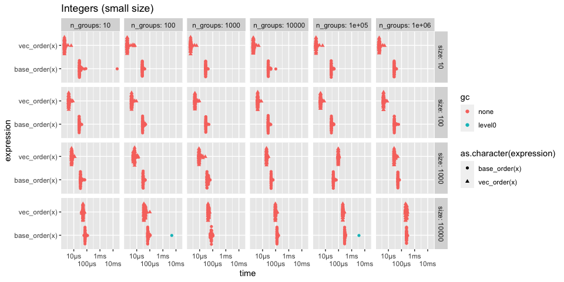<!-- -->

### Test 2

  - Varying total size (large)
  - Varying number of groups

<!-- end list -->

``` r
set.seed(123)

size <- 10 ^ (5:7)
n_groups <- 10 ^ (1:6)

df <- bench::press(
  size = size,
  n_groups = n_groups,
  {
    x <- sample(n_groups, size, replace = TRUE)
    bench::mark(vec_order(x), base_order(x), iterations = 10)
  }
)
```

Performance seems to be generally about the same no matter the size or
number of groups.

``` r
autoplot_shaped(df) + 
  guides(x = guide_axis(n.dodge = 2)) +
  ggtitle("Integers (large size)")
```

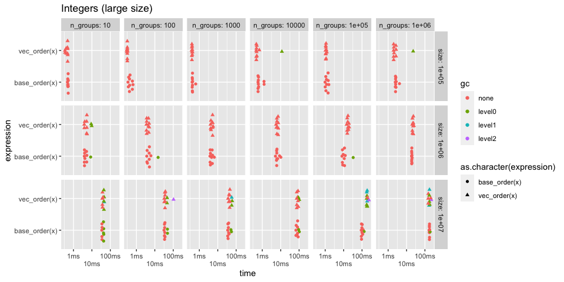<!-- -->

Zoom into few groups, large size case

``` r
df %>%
  filter_bench(n_groups == 10, size == 1e7) %>%
  autoplot_shaped()
```

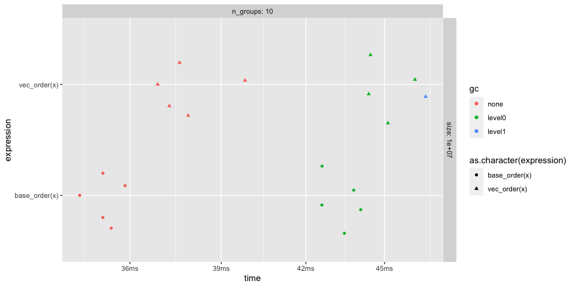<!-- -->

Zoom into many groups, large size case

``` r
df %>%
  filter_bench(n_groups == 1e6, size == 1e7) %>%
  autoplot_shaped()
```

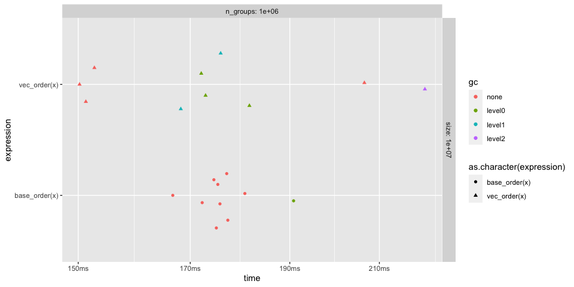<!-- -->

### Test 3

Investigating the performance of switching from the counting sort to the
radix sort. This happens at `INT_COUNTING_ORDER_RANGE_BOUNDARY` which is
100,000.

``` r
set.seed(123)

n_groups <- c(80000, 90000, 99999, 100001, 110000, 120000)
size <- 1e7

df <- bench::press(
  n_groups = n_groups,
  {
    x <- sample(n_groups, size, replace = TRUE)
    bench::mark(vec_order(x), base_order(x), iterations = 20)
  }
)
```

There is a definite jump in performance when initially moving to the
counting sort. Perhaps this boundary isn’t optimal, but it seems to
scale well after the boundary.

``` r
autoplot_shaped(df) +
  facet_wrap(~ n_groups, ncol = 1, labeller = label_both)
```

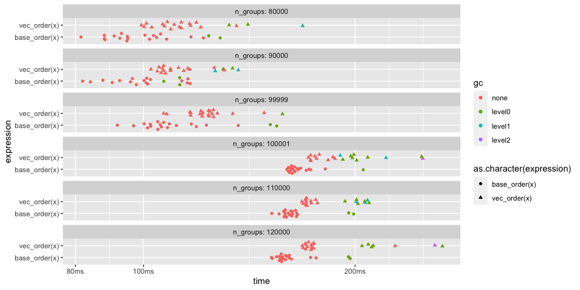<!-- -->

## Doubles

Double performance is overall similar to integers when compared with
`order()`. It is generally slower than ordering integers because a
maximum of 8 passes are required to order a double (8 bytes vs 4 bytes
in integers).

### Test 1

  - Varying total size (small)
  - Varying group size

<!-- end list -->

``` r
set.seed(123)

size <- 10 ^ (1:4)
n_groups <- 10 ^ (1:6)

df <- bench::press(
  size = size,
  n_groups = n_groups,
  {
    x <- sample(n_groups, size, replace = TRUE) + 0
    bench::mark(vec_order(x), base_order(x), iterations = 50)
  }
)
```

Performance is about the same.

``` r
autoplot_shaped(df) +
  guides(x = guide_axis(n.dodge = 2)) +
  ggtitle("Doubles (small size)")
```

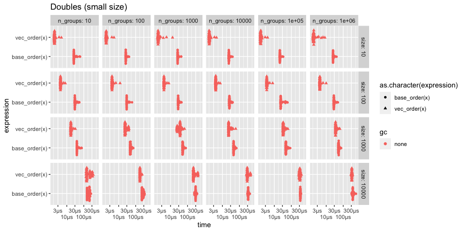<!-- -->

### Test 2

  - Varying total size (large)
  - Varying number of groups

<!-- end list -->

``` r
set.seed(123)

size <- 10 ^ (5:7)
n_groups <- 10 ^ (1:6)

df <- bench::press(
  size = size,
  n_groups = n_groups,
  {
    x <- sample(n_groups, size, replace = TRUE) + 0
    
    bench::mark(
      vec_order(x),
      base_order(x),
      iterations = 10
    )
  }
)
```

I imagine the increase in gc’s for large sizes comes from the fact that
`vec_order()` uses `Rf_allocVector()` to generate its working memory,
and `base_order()` uses `malloc()`, which won’t trigger a gc.

``` r
autoplot_shaped(df) + 
  guides(x = guide_axis(n.dodge = 2)) +
  ggtitle("Doubles (large size)")
```

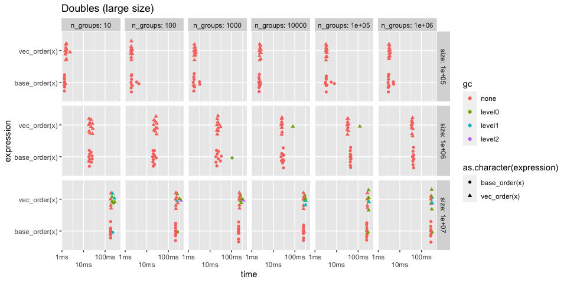<!-- -->

## Characters

I expect to be slightly slower with character vectors, as base R has
access to macros for `TRUELENGTH()` and `LEVELS()` (used to determine
encoding), but we have to call their function equivalents.

There is also an additional component here, the maximum string length.
The longest string in the vector determines how many “passes” are
required in the radix sort. Longer strings mean more passes which
generally takes more time. However, keep in mind that we only radix sort
the unique strings, so this often doesn’t hurt us that much (like in
dplyr where we group on a character column with just a few groups).

### Test 1

  - Varying total size (small)
  - Varying group size
  - String length of 5-20 characters

<!-- end list -->

``` r
set.seed(123)

size <- 10 ^ (1:4)
n_groups <- 10 ^ (1:6)

df <- bench::press(
  size = size,
  n_groups = n_groups,
  {
    dict <- new_dictionary(n_groups, min_length = 5, max_length = 20)
    x <- sample(dict, size, replace = TRUE)
    bench::mark(vec_order(x), base_order(x), iterations = 50)
  }
)
```

``` r
autoplot_shaped(df) +
  guides(x = guide_axis(n.dodge = 2)) +
  ggtitle("Characters (small size)")
```

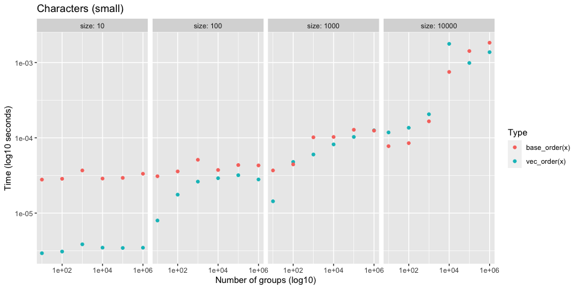<!-- -->

As expected, for small ish sizes we are somewhat slower. This difference
seems to go away as you increase the number of groups.

``` r
df %>%
  mutate(expression = as.character(expression)) %>%
  filter_bench(size == 10000)
#>  # A tibble: 12 x 8
#>     expression     size n_groups      min   median `itr/sec` mem_alloc `gc/sec`
#>     <chr>         <dbl>    <dbl> <bch:tm> <bch:tm>     <dbl> <bch:byt>    <dbl>
#>   1 vec_order(x)  10000       10  99.75µs 109.69µs     9077.   439.8KB      0  
#>   2 base_order(x) 10000       10   73.6µs  76.43µs    12662.    39.1KB      0  
#>   3 vec_order(x)  10000      100    115µs 128.07µs     7919.   439.8KB      0  
#>   4 base_order(x) 10000      100  81.97µs  84.68µs    10854.    39.1KB      0  
#>   5 vec_order(x)  10000     1000 178.84µs  192.1µs     5151.   439.8KB      0  
#>   6 base_order(x) 10000     1000 156.21µs 161.95µs     5934.    39.1KB      0  
#>   7 vec_order(x)  10000    10000   1.56ms   1.82ms      530.   439.8KB      0  
#>   8 base_order(x) 10000    10000 857.35µs 966.28µs     1022.    39.1KB      0  
#>   9 vec_order(x)  10000   100000 673.55µs 752.54µs     1327.   439.8KB      0  
#>  10 base_order(x) 10000   100000    1.1ms   1.45ms      698.    39.1KB     14.2
#>  11 vec_order(x)  10000  1000000   1.13ms    1.4ms      713.   439.8KB      0  
#>  12 base_order(x) 10000  1000000    1.8ms   1.89ms      503.    39.1KB      0
```

### Test 2

  - Varying total size (large)
  - Varying number of groups
  - String length of 5-20 characters

<!-- end list -->

``` r
set.seed(123)

size <- 10 ^ (5:7)
n_groups <- 10 ^ (1:6)

df <- bench::press(
  size = size,
  n_groups = n_groups,
  {
    dict <- new_dictionary(n_groups, min_length = 5, max_length = 20)
    x <- sample(dict, size, replace = TRUE)
    bench::mark(vec_order(x), base_order(x), iterations = 10)
  }
)
```

Generally about the same once the size gets larger

``` r
autoplot_shaped(df) + 
  guides(x = guide_axis(n.dodge = 2)) +
  ggtitle("Characters (large size)")
```

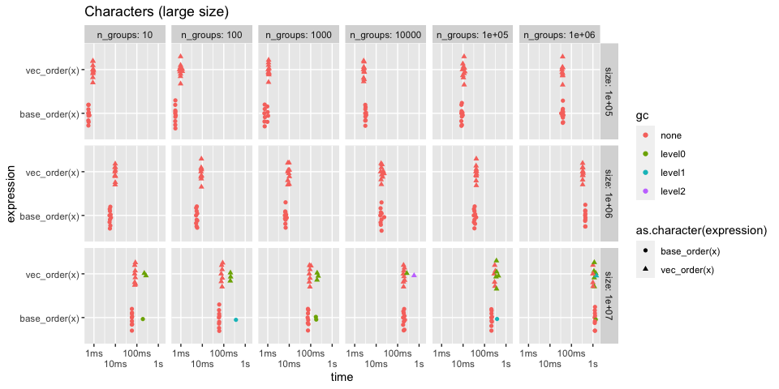<!-- -->

Zoom into the size 1e7 row

As the number of unique strings increases, we have to radix order more
strings. This generally takes more time.

``` r
df %>%
  filter_bench(size == 1e7) %>%
  select(-size) %>%
  autoplot("boxplot") +
  facet_wrap(~ n_groups, labeller = label_both, ncol = 1) +
  ggtitle("Characters, fixed size of 1e7")
```

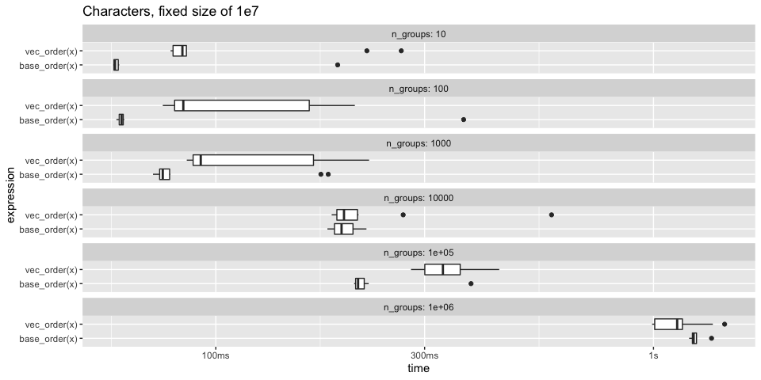<!-- -->

### Test 3

Very large set of completely random strings

``` r
set.seed(123)

n_groups <- 1e7

x <- new_dictionary(n_groups, min_length = 5, max_length = 20)

bench::mark(vec_order(x), base_order(x), iterations = 10)
#>  # A tibble: 2 x 6
#>    expression         min   median `itr/sec` mem_alloc `gc/sec`
#>    <bch:expr>    <bch:tm> <bch:tm>     <dbl> <bch:byt>    <dbl>
#>  1 vec_order(x)     5.07s    5.35s     0.175   855.8MB   0.280 
#>  2 base_order(x)    5.91s    5.92s     0.167    38.1MB   0.0167
```

### Test 4

What is the effect of string size on total time?

  - Longer strings generally means more passes are required (one pass
    per character)
  - It is related to number of groups (i.e. number of unique strings) in
    two ways:
      - Only unique strings are sorted
      - As soon as it can tell all strings apart it stops

<!-- end list -->

``` r
set.seed(123)

size <- 1e6

n_groups <- 10 ^ (1:6)
string_size <- c(10, 20, 40, 60, 80, 100)

df <- bench::press(
  string_size = string_size,
  n_groups = n_groups,
  {
    dict <- new_dictionary(n_groups, string_size, string_size)
    x <- sample(dict, size, replace = TRUE)
    bench::mark(vec_order(x), base_order(x), iterations = 10)
  }
)
```

The string size doesn’t seem to add *too* much more time.

``` r
autoplot_shaped(df) + 
  guides(x = guide_axis(n.dodge = 2)) +
  ggtitle(
    "Characters - Varying string size",
    subtitle = "Most informative to look down the columns"
  )
```

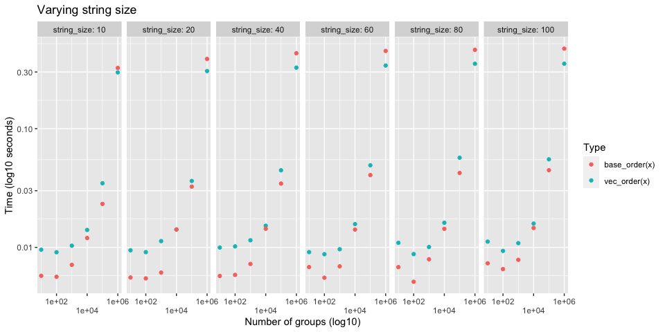<!-- -->

Zoom in to 1e6 groups and varying string size. Here you can see that
there is some effect on total time. Larger maximum string size = more
time required, but it isn’t that bad.

We also seem to consistently do better than `order()` when most of the
strings are unique. My guess is that this is a consequence of the fact
that I store the results of `Rf_length()` on each string (this queries
the nchars of the string) so I don’t have to call that function
repeatedly in the recursive section of the algorithm. `order()` doesn’t
do this. This adds a little memory overhead, but makes up for that in
speed.

``` r
df %>%
  filter_bench(n_groups == 1e6) %>% 
  select(-n_groups) %>%
  autoplot_shaped() + 
  facet_wrap(~ string_size, ncol = 1, labeller = label_both) +
  ggtitle("Characters - Varying string size, all unique strings")
```

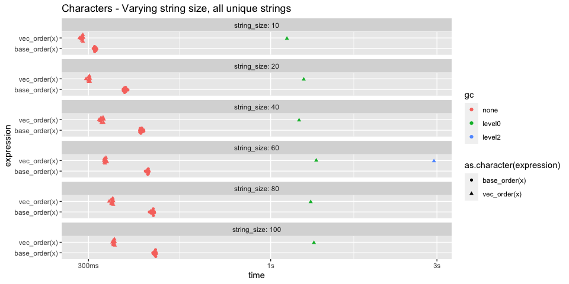<!-- -->

## Completely sorted sequences

Both base and vctrs use a fast check for sortedness up front. For the
very specific case of integer vectors with default options, base has an
even faster sortedness check that beats us, but I’m not too worried
about it. It can also return an ALTREP sequence, so it doesn’t get hit
with memory overhead.

``` r
x <- 1:1e7 + 0L

# Base is faster (simpler check + ALTREP result)
bench::mark(
  vec_order(x), 
  base_order(x),
  iterations = 50
)
#>  # A tibble: 2 x 6
#>    expression         min   median `itr/sec` mem_alloc `gc/sec`
#>    <bch:expr>    <bch:tm> <bch:tm>     <dbl> <bch:byt>    <dbl>
#>  1 vec_order(x)   22.92ms   23.9ms      41.2    38.1MB     3.58
#>  2 base_order(x)   6.17ms   6.44ms     154.         0B     0

# But tweak some options and it becomes closer
bench::mark(
  vec_order(x, direction = "desc", na_value = "smallest"), 
  base_order(x, decreasing = TRUE, na.last = FALSE),
  iterations = 50
)
#>  # A tibble: 2 x 6
#>    expression                                                 min median
#>    <bch:expr>                                              <bch:> <bch:>
#>  1 vec_order(x, direction = "desc", na_value = "smallest") 19.4ms 20.4ms
#>  2 base_order(x, decreasing = TRUE, na.last = FALSE)       13.6ms 14.7ms
#>  # … with 3 more variables: `itr/sec` <dbl>, mem_alloc <bch:byt>, `gc/sec` <dbl>
```

## Nearly sorted sequence

Nearly sorted integer vectors is one case where base does a little
better than we do for some reason. I can’t seem to figure out why. But
it doesn’t ever seem to be a dramatic difference.

``` r
x <- c(1:1e7, 1:20) + 0L

bench::mark(
  vec_order(x), 
  base_order(x),
  iterations = 20
)
#>  # A tibble: 2 x 6
#>    expression         min   median `itr/sec` mem_alloc `gc/sec`
#>    <bch:expr>    <bch:tm> <bch:tm>     <dbl> <bch:byt>    <dbl>
#>  1 vec_order(x)     178ms    180ms      5.55   162.1MB     1.85
#>  2 base_order(x)    152ms    153ms      6.50    38.1MB     0
```

The performance difference goes away (for the most part) with doubles

``` r
x <- c(1:1e7, 1:20) + 0

bench::mark(
  vec_order(x), 
  base_order(x),
  iterations = 20
)
#>  # A tibble: 2 x 6
#>    expression         min   median `itr/sec` mem_alloc `gc/sec`
#>    <bch:expr>    <bch:tm> <bch:tm>     <dbl> <bch:byt>    <dbl>
#>  1 vec_order(x)     300ms    303ms      3.29   238.4MB    2.20 
#>  2 base_order(x)    286ms    290ms      3.45    38.1MB    0.182
```

## Multiple columns

It is also worth comparing with multiple columns, since this is what a
group by would typically do.

### Test 1

  - Large size
  - Col 1 - Integer vector of 20 groups
  - Col 2 - Integer vector of 100 groups

This uses a counting sort for both since the ranges are small

Performance is around the same.

``` r
set.seed(123)

size <- 1e7

n_groups1 <- 20
n_groups2 <- 100

df <- data.frame(
  x = sample(n_groups1, size, replace = TRUE),
  y = sample(n_groups2, size, replace = TRUE)
)

bench::mark(vec_order(df), base_order(df), iterations = 10)
#>  # A tibble: 2 x 6
#>    expression          min   median `itr/sec` mem_alloc `gc/sec`
#>    <bch:expr>     <bch:tm> <bch:tm>     <dbl> <bch:byt>    <dbl>
#>  1 vec_order(df)     121ms    121ms      8.23   114.8MB    3.53 
#>  2 base_order(df)    140ms    144ms      6.96    38.1MB    0.773
```

### Test 2a

  - Large size
  - Col 1 - Double vector of 20 groups
  - Col 2 - Double vector of 100 groups

This uses a radix sort for both since there is no counting sort for
doubles.

Performance is around the same.

``` r
set.seed(123)

size <- 1e7

n_groups1 <- 20
n_groups2 <- 100

df <- data.frame(
  x = sample(n_groups1, size, replace = TRUE) + 0,
  y = sample(n_groups2, size, replace = TRUE) + 0
)

bench::mark(vec_order(df), base_order(df), iterations = 10)
#>  # A tibble: 2 x 6
#>    expression          min   median `itr/sec` mem_alloc `gc/sec`
#>    <bch:expr>     <bch:tm> <bch:tm>     <dbl> <bch:byt>    <dbl>
#>  1 vec_order(df)     439ms    447ms      2.24   238.8MB    1.50 
#>  2 base_order(df)    467ms    473ms      2.12    38.1MB    0.236
```

### Test 2b

Like test 2a, but the doubles groups are very spread out.

We tend to do much better here, but I am not entirely sure why.

``` r
set.seed(123)

size <- 1e7

n_groups1 <- 20
n_groups2 <- 100

dict1 <- sample(1e15, n_groups1)
dict2 <- sample(1e15, n_groups2)

df <- data.frame(
  x = sample(dict1, size, replace = TRUE) + 0,
  y = sample(dict2, size, replace = TRUE) + 0
)

bench::mark(vec_order(df), base_order(df), iterations = 10)
#>  # A tibble: 2 x 6
#>    expression          min   median `itr/sec` mem_alloc `gc/sec`
#>    <bch:expr>     <bch:tm> <bch:tm>     <dbl> <bch:byt>    <dbl>
#>  1 vec_order(df)     543ms    546ms      1.83   238.8MB    1.83 
#>  2 base_order(df)    933ms    938ms      1.07    38.1MB    0.118
```

### Test 3a

20 integer columns, each with 2 groups. 1e6 total size.

There end up being around 64,000 unique rows

Performance is about the same

``` r
set.seed(123)

size <- 1e6L
n_groups <- 2
n_cols <- 20

cols <- replicate(n_cols, sample(n_groups, size, TRUE), simplify = FALSE)
names(cols) <- seq_along(cols)
df <- vctrs::new_data_frame(cols, size)

bench::mark(vec_order(df), base_order(df), iterations = 10)
#>  # A tibble: 2 x 6
#>    expression          min   median `itr/sec` mem_alloc `gc/sec`
#>    <bch:expr>     <bch:tm> <bch:tm>     <dbl> <bch:byt>    <dbl>
#>  1 vec_order(df)     192ms    198ms      5.06   19.84MB    0.563
#>  2 base_order(df)    182ms    188ms      5.32    3.82MB    0
```

### Test 3b

Same as before but with character columns. We do slightly worse here.

``` r
set.seed(123)

size <- 1e6L
n_groups <- 2
n_cols <- 20

cols <- replicate(
  n_cols, 
  {
    dict <- new_dictionary(n_groups, 5, 10)
    sample(dict, size, TRUE)
  }, 
  simplify = FALSE
)

names(cols) <- seq_along(cols)
df <- vctrs::new_data_frame(cols, size)

bench::mark(vec_order(df), base_order(df), iterations = 10)
#>  # A tibble: 2 x 6
#>    expression          min   median `itr/sec` mem_alloc `gc/sec`
#>    <bch:expr>     <bch:tm> <bch:tm>     <dbl> <bch:byt>    <dbl>
#>  1 vec_order(df)     367ms    371ms      2.69   32.54MB    0.673
#>  2 base_order(df)    274ms    279ms      3.59    3.82MB    0
```

## Compare with `vec_unique_loc()`

It is worth comparing to `vec_unique_loc()`, which is the most bare
bones of the uniqueness functions, to test whether or not
uniqueness-by-sorting can be faster than uniqueness-by-hashing.

In a branch, I hacked together an implementation of `vec_unique_loc()`
based on `vec_order()`. It takes approximately the same amount of time
as `vec_order()` itself, so I will just use `vec_order()` as a proxy for
the sorting approach.

### Test 1

  - Integers
  - Varying total size (small)
  - Varying group size

<!-- end list -->

``` r
set.seed(123)

size <- 10 ^ (1:4)
n_groups <- 10 ^ (1:6)

df <- bench::press(
  size = size,
  n_groups = n_groups,
  {
    x <- sample(n_groups, size, replace = TRUE)
    bench::mark(vec_order(x), vec_unique_loc(x), iterations = 50, check = FALSE)
  }
)
```

Performance is about the same for small sizes

``` r
autoplot_shaped(df) +
  guides(x = guide_axis(n.dodge = 2)) +
  ggtitle("Integers (small size)")
```

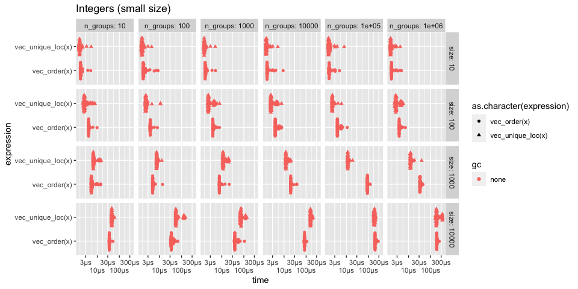<!-- -->

### Test 2

  - Integers
  - Varying total size (large)
  - Varying number of groups

<!-- end list -->

``` r
set.seed(123)

size <- 10 ^ (5:7)
n_groups <- 10 ^ (1:6)

df <- bench::press(
  size = size,
  n_groups = n_groups,
  {
    x <- sample(n_groups, size, replace = TRUE)
    bench::mark(vec_order(x), vec_unique_loc(x), iterations = 20, check = FALSE)
  }
)
```

As the total size increases, `vec_order()` starts to do much better.

``` r
autoplot_shaped(df) + 
  guides(x = guide_axis(n.dodge = 2)) +
  ggtitle("Integers (large size)")
```

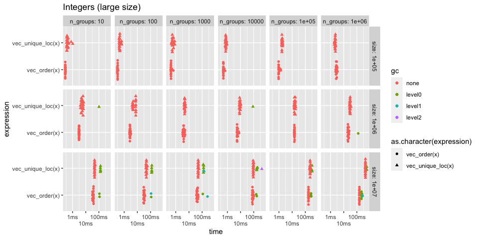<!-- -->

Zoom into size=1e6, n\_groups=10. I imagine this is a typical example we
might see.

``` r
df %>% filter_bench(size == 1e6, n_groups == 10)
#>  # A tibble: 2 x 8
#>    expression           size n_groups     min median `itr/sec` mem_alloc `gc/sec`
#>    <bch:expr>          <dbl>    <dbl> <bch:t> <bch:>     <dbl> <bch:byt>    <dbl>
#>  1 vec_order(x)      1000000       10  2.92ms 3.09ms      322.    3.81MB     0   
#>  2 vec_unique_loc(x) 1000000       10  3.94ms 5.43ms      186.   11.82MB     9.79
```

In particular, at size=1e7 as the number of groups increases,
`vec_order()` starts to pull away.

``` r
df %>%
  filter_bench(size == 1e7, n_groups >= 10000)
#>  # A tibble: 6 x 8
#>    expression          size n_groups     min  median `itr/sec` mem_alloc `gc/sec`
#>    <bch:expr>         <dbl>    <dbl> <bch:t> <bch:t>     <dbl> <bch:byt>    <dbl>
#>  1 vec_order(x)      1.00e7    10000  75.3ms  81.9ms     11.8     38.1MB    1.32 
#>  2 vec_unique_loc(x) 1.00e7    10000    89ms  93.7ms     10.7    102.3MB    3.58 
#>  3 vec_order(x)      1.00e7   100000 167.7ms 173.2ms      5.75   162.1MB    1.44 
#>  4 vec_unique_loc(x) 1.00e7   100000 212.1ms 232.7ms      4.30   103.5MB    0.760
#>  5 vec_order(x)      1.00e7  1000000 148.4ms 153.2ms      6.52   162.1MB    3.51 
#>  6 vec_unique_loc(x) 1.00e7  1000000 422.7ms 440.2ms      2.28     114MB    0.253

df %>%
  filter_bench(size == 1e7, n_groups >= 10000) %>%
  select(-size) %>%
  autoplot_shaped() +
  facet_wrap(~n_groups, ncol = 1, labeller = label_both)
```

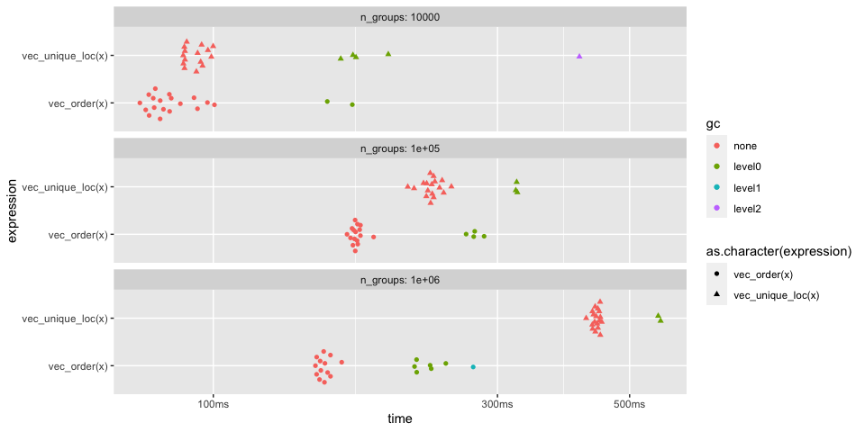<!-- -->

### Test 3

Currently string ordering is much slower than `vec_unique_loc()`
(especially when most strings are unique) due to all of the allocations
that are required + the fact that it does a radix ordering of unique
strings and then an integer radix ordering after that.

I am confident that the C level part of `vec_order()` could gain a
`sort_character = false` option that would do a much faster counting
sort in order-of-first-appearance that utilizes the truelengths in a
different way. It wouldn’t sort strings at all, so should be very fast.
This is what `cgroup()` does in `base::order()`, which is not currently
implemented in `vec_order()` because I didn’t have a use for it until
now.
<https://github.com/wch/r-source/blob/8d7ac4699fba640d030703fa010b66bf26054cbd/src/main/radixsort.c#L1051>

Very large set of strings with 10 groups

  - Don’t notice much of a difference between the two here, because
    there aren’t many unique strings.

<!-- end list -->

``` r
set.seed(123)

size <- 1e7
n_groups <- 10

dict <- new_dictionary(n_groups, min_length = 5, max_length = 20)
x <- sample(dict, size, TRUE)

bench::mark(vec_order(x), vec_unique_loc(x), iterations = 10, check = FALSE)
#>  # A tibble: 2 x 6
#>    expression             min   median `itr/sec` mem_alloc `gc/sec`
#>    <bch:expr>        <bch:tm> <bch:tm>     <dbl> <bch:byt>    <dbl>
#>  1 vec_order(x)        78.6ms   81.5ms      11.8     124MB     1.31
#>  2 vec_unique_loc(x)   81.6ms   83.4ms      11.9     102MB     2.98
```

Very large set of completely random strings

  - Extremely large difference, because `vec_order()` is doing way too
    much work to actually sort the strings.

<!-- end list -->

``` r
set.seed(123)

n_groups <- 1e7

x <- new_dictionary(n_groups, min_length = 5, max_length = 20)

bench::mark(vec_order(x), vec_unique_loc(x), iterations = 10, check = FALSE)
#>  # A tibble: 2 x 6
#>    expression             min   median `itr/sec` mem_alloc `gc/sec`
#>    <bch:expr>        <bch:tm> <bch:tm>     <dbl> <bch:byt>    <dbl>
#>  1 vec_order(x)         5.13s    5.83s     0.167     856MB    0.335
#>  2 vec_unique_loc(x)    1.16s    1.52s     0.656     268MB    0.328
```
