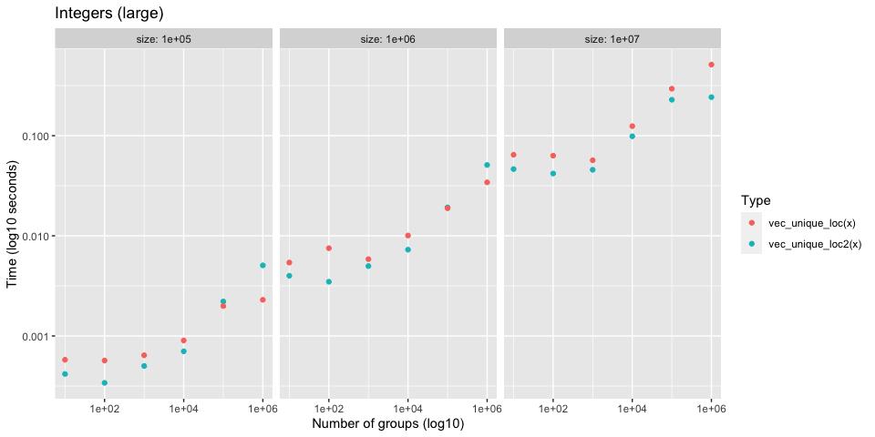
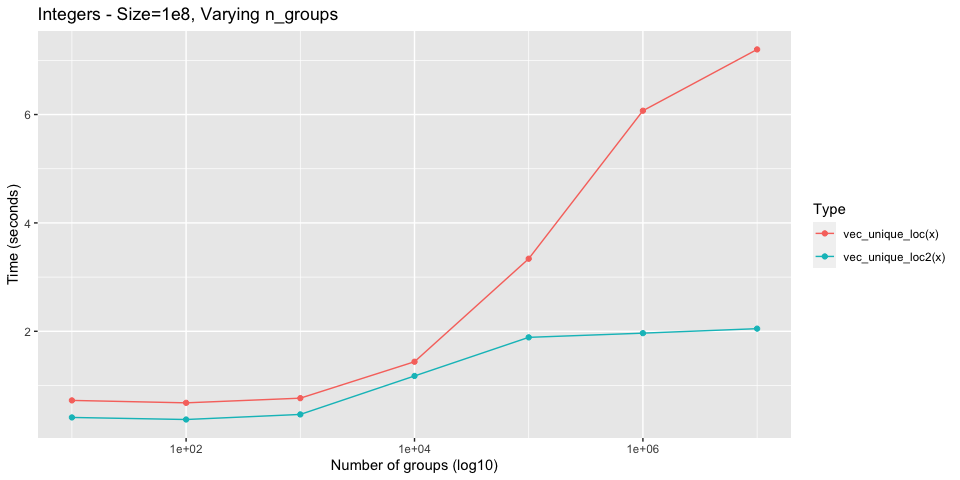
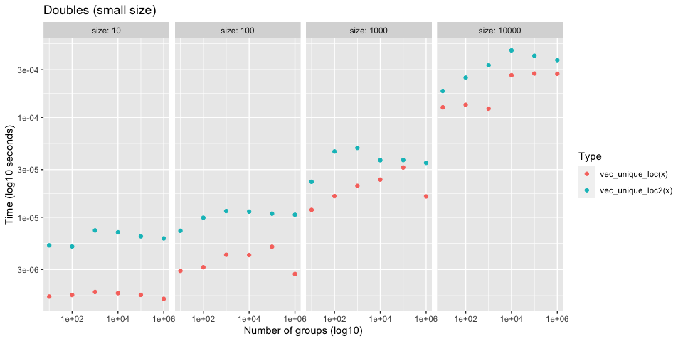
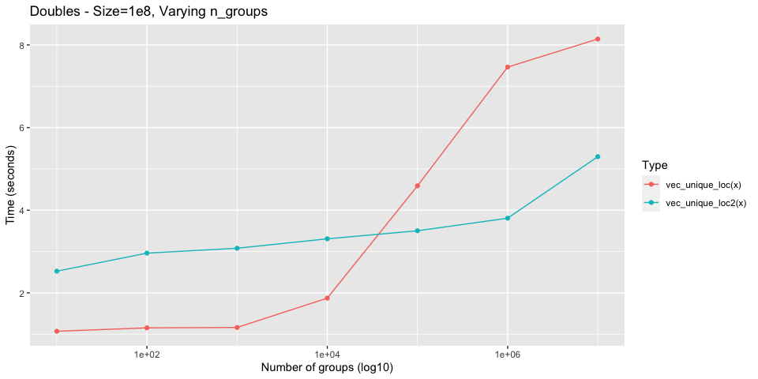

Sorting vs Hashing
================

Investigates performance of hash based (`vec_unique_loc()`) vs sort
based (`vec_unique_loc2()`) approaches to ordering.

Remember that, in addition to any potential speed ups, the sort based
approach also works for large vectors where the dictionary approach
currently fails due to an overflow
(<https://github.com/r-lib/vctrs/issues/1133>).

## Setup

``` r
library(vctrs)
library(rlang)
library(stringr)
library(ggplot2)
library(dplyr)

vec_unique_loc2 <- vctrs:::vec_unique_loc2
```

``` r
# Generate `size` random words of varying string sizes
new_dictionary <- function(size, min_length, max_length) {
  lengths <- rlang::seq2(min_length, max_length)

  stringi::stri_rand_strings(
    size,
    sample(lengths, size = size, replace = TRUE)
  )
}
```

``` r
# Work around bench_expr bug where vectorized attribute isn't being sliced
# https://github.com/r-lib/bench/pull/90

filter_bench <- function(.data, ...) {
  out <- dplyr::mutate(.data, rn = row_number()) %>%
    dplyr::filter(...)
  
  # patch up bench_expr
  which <- out$rn
  desc <- attr(.data$expression, "description")
  attr(out$expression, "description") <- desc[which]
  
  out$rn <- NULL
  
  out
}
```

``` r
plot_bench <- function(df, title = waiver()) {
  df %>%
    ggplot(aes(x = n_groups, y = as.numeric(median))) +
    geom_point(aes(color = as.character(expression))) +
    facet_wrap(~ size, labeller = label_both, nrow = 1) +
    scale_x_log10() +
    scale_y_log10() + 
    labs(
      x = "Number of groups (log10)",
      y = "Time (log10 seconds)",
      color = "Type",
      title = title
    )
}
```

## Compare with `vec_unique_loc()`

It is worth comparing to `vec_unique_loc()`, which is the most bare
bones of the uniqueness functions, to test whether or not
uniqueness-by-sorting can be faster than uniqueness-by-hashing.

## Integers

### Test 1

-   Integers
-   Varying total size (small)
-   Varying group size

``` r
set.seed(123)

size <- 10 ^ (1:4)
n_groups <- 10 ^ (1:6)

df <- bench::press(
  size = size,
  n_groups = n_groups,
  {
    x <- sample(n_groups, size, replace = TRUE)
    bench::mark(
      vec_unique_loc2(x), 
      vec_unique_loc(x), 
      iterations = 100
    )
  }
)
```

For very small sizes, `vec_unique_loc()` is a little faster. Probably
due to the allocations required to set up `vec_unique_loc2()`. This
difference disappears relatively fast.

<!-- -->

### Test 2

-   Integers
-   Varying total size (large)
-   Varying number of groups

``` r
set.seed(123)

size <- 10 ^ (5:7)
n_groups <- 10 ^ (1:6)

df <- bench::press(
  size = size,
  n_groups = n_groups,
  {
    x <- sample(n_groups, size, replace = TRUE)
    bench::mark(
      vec_unique_loc2(x), 
      vec_unique_loc(x), 
      iterations = 20
    )
  }
)
```

As the total size increases, `vec_unique_loc2()` starts to do better.

<!-- -->

### Test 3

This benchmark shows how much better `vec_unique_loc2()` scales for
large size and large number of groups. For integers it is always faster,
and scales extremely well.

``` r
set.seed(123)

size <- 10 ^ 8
n_groups <- 10 ^ (1:7)

df <- bench::press(
  size = size,
  n_groups = n_groups,
  {
    x <- sample(n_groups, size, replace = TRUE)
    bench::mark(
      vec_unique_loc2(x), 
      vec_unique_loc(x), 
      iterations = 20
    )
  }
)
```

<!-- -->

## Doubles

### Test 1

-   Doubles
-   Varying total size (small)
-   Varying group size

``` r
set.seed(123)

size <- 10 ^ (1:4)
n_groups <- 10 ^ (1:6)

df <- bench::press(
  size = size,
  n_groups = n_groups,
  {
    x <- sample(n_groups, size, replace = TRUE) + 0
    bench::mark(
      vec_unique_loc2(x), 
      vec_unique_loc(x), 
      iterations = 100,
    )
  }
)
```

`vec_unique_loc2()` is generally a bit slower for these smaller sizes,
but it scales much better with large sizes and larger number of groups.
See the next test.

<!-- -->

### Test 2

This benchmark shows how much better `vec_unique_loc2()` scales for
large size and large number of groups. For doubles it is slower up front
(large unavoidable allocations when there are few groups), but scales
much better.

``` r
set.seed(123)

size <- 10 ^ 8
n_groups <- 10 ^ (1:7)

df <- bench::press(
  size = size,
  n_groups = n_groups,
  {
    x <- sample(n_groups, size, replace = TRUE) + 0
    bench::mark(
      vec_unique_loc2(x), 
      vec_unique_loc(x), 
      iterations = 20, 
    )
  }
)
```

<!-- -->

## Characters

### Test 1

Very large set of strings with 10 groups

Don’t notice much of a difference between the two here.

``` r
set.seed(123)

size <- 1e7
n_groups <- 10

dict <- new_dictionary(n_groups, min_length = 5, max_length = 20)
x <- sample(dict, size, TRUE)

bench::mark(
  vec_unique_loc2(x),
  vec_unique_loc(x), 
  iterations = 10
)
#>  # A tibble: 2 x 6
#>    expression              min   median `itr/sec` mem_alloc `gc/sec`
#>    <bch:expr>         <bch:tm> <bch:tm>     <dbl> <bch:byt>    <dbl>
#>  1 vec_unique_loc2(x)   85.2ms   93.2ms     10.6     38.6MB        0
#>  2 vec_unique_loc(x)    92.5ms  109.1ms      9.25   102.1MB        0
```

Very large set of completely random strings

Ordering character vectors by first appearance (i.e. using
`vec_order_info(chr_ordered = FALSE)`) in `vec_unique_loc2()` allows it
to remain competitive with `vec_unique_loc()`.

``` r
set.seed(123)

n_groups <- 1e7

x <- new_dictionary(n_groups, min_length = 5, max_length = 20)

bench::mark(
  vec_unique_loc2(x), 
  vec_unique_loc(x), 
  iterations = 10
)
#>  # A tibble: 2 x 6
#>    expression              min   median `itr/sec` mem_alloc `gc/sec`
#>    <bch:expr>         <bch:tm> <bch:tm>     <dbl> <bch:byt>    <dbl>
#>  1 vec_unique_loc2(x)    560ms    564ms      1.74     317MB    0.746
#>  2 vec_unique_loc(x)     677ms    686ms      1.46     268MB    0.626
```

## Multiple columns

### Test 1

3 integer columns, each with 20 groups. 1e7 total size.

``` r
set.seed(123)

size <- 1e7L
n_groups <- 20
n_cols <- 3

cols <- replicate(n_cols, sample(n_groups, size, TRUE), simplify = FALSE)
names(cols) <- seq_along(cols)
df <- vctrs::new_data_frame(cols, size)

bench::mark(
  vec_unique_loc2(df), 
  vec_unique_loc(df), 
  iterations = 10
)
#>  # A tibble: 2 x 6
#>    expression               min   median `itr/sec` mem_alloc `gc/sec`
#>    <bch:expr>          <bch:tm> <bch:tm>     <dbl> <bch:byt>    <dbl>
#>  1 vec_unique_loc2(df)    245ms    254ms      3.95     115MB    0.439
#>  2 vec_unique_loc(df)     265ms    275ms      3.64     102MB    0.405
```

### Test 2

Again, pretty competitive with `vec_unique_loc()` due to ordering
characters by first appearance.

``` r
set.seed(123)

size <- 1e7L
n_groups <- 20
n_cols <- 3

cols <- replicate(
  n_cols, 
  {
    dict <- new_dictionary(n_groups, 5, 20)
    sample(dict, size, TRUE)
  }, 
  simplify = FALSE
)

names(cols) <- seq_along(cols)
df <- vctrs::new_data_frame(cols, size)

bench::mark(
  vec_unique_loc2(df), 
  vec_unique_loc(df), 
  iterations = 5
)
#>  # A tibble: 2 x 6
#>    expression               min   median `itr/sec` mem_alloc `gc/sec`
#>    <bch:expr>          <bch:tm> <bch:tm>     <dbl> <bch:byt>    <dbl>
#>  1 vec_unique_loc2(df)    485ms    499ms      2.02     153MB    0.504
#>  2 vec_unique_loc(df)     399ms    403ms      2.47     102MB    0
```

### Test 3

20 integer columns, each with 2 groups. 1e7 total size.

``` r
set.seed(123)

size <- 1e7L
n_groups <- 2
n_cols <- 20

cols <- replicate(n_cols, sample(n_groups, size, TRUE), simplify = FALSE)
names(cols) <- seq_along(cols)
df <- vctrs::new_data_frame(cols, size)

bench::mark(
  vec_unique_loc2(df), 
  vec_unique_loc(df), 
  iterations = 5
)
#>  # A tibble: 2 x 6
#>    expression               min   median `itr/sec` mem_alloc `gc/sec`
#>    <bch:expr>          <bch:tm> <bch:tm>     <dbl> <bch:byt>    <dbl>
#>  1 vec_unique_loc2(df)    2.92s    2.94s     0.341     149MB   0.227 
#>  2 vec_unique_loc(df)     4.68s     4.7s     0.213     114MB   0.0532
```
