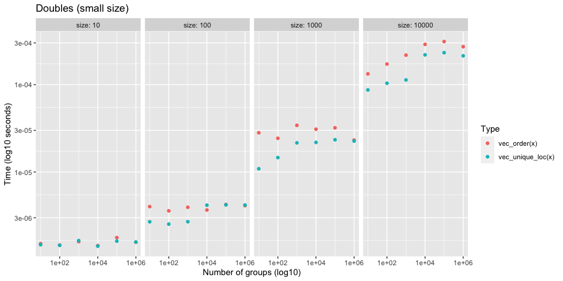
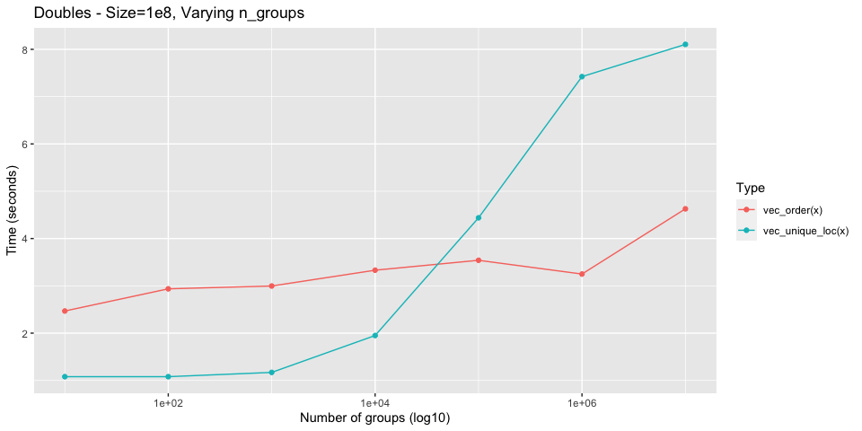

Sorting vs Hashing
================

Investigates performance of `vec_order()` vs current implementation of
`vec_unique()`, which is based on hashing and a dictionary. It might be
worth switching to use the sort based approach of `vec_order()`.

## Setup

``` r
library(vctrs)
library(rlang)
library(stringr)
library(ggplot2)
library(dplyr)
```

``` r
# Generate `size` random words of varying string sizes
new_dictionary <- function(size, min_length, max_length) {
  lengths <- rlang::seq2(min_length, max_length)

  stringi::stri_rand_strings(
    size,
    sample(lengths, size = size, replace = TRUE)
  )
}
```

``` r
# Work around bench_expr bug where vectorized attribute isn't being sliced
# https://github.com/r-lib/bench/pull/90

filter_bench <- function(.data, ...) {
  out <- dplyr::mutate(.data, rn = row_number()) %>%
    dplyr::filter(...)
  
  # patch up bench_expr
  which <- out$rn
  desc <- attr(.data$expression, "description")
  attr(out$expression, "description") <- desc[which]
  
  out$rn <- NULL
  
  out
}
```

``` r
plot_bench <- function(df, title = waiver()) {
  df %>%
    ggplot(aes(x = n_groups, y = as.numeric(median))) +
    geom_point(aes(color = as.character(expression))) +
    facet_wrap(~ size, labeller = label_both, nrow = 1) +
    scale_x_log10() +
    scale_y_log10() + 
    labs(
      x = "Number of groups (log10)",
      y = "Time (log10 seconds)",
      color = "Type",
      title = title
    )
}
```

## Compare with `vec_unique_loc()`

It is worth comparing to `vec_unique_loc()`, which is the most bare
bones of the uniqueness functions, to test whether or not
uniqueness-by-sorting can be faster than uniqueness-by-hashing.

In a branch, I hacked together an implementation of `vec_unique_loc()`
based on `vec_order()`. It takes approximately the same amount of time
as `vec_order()` itself, so I will just use `vec_order()` as a proxy for
the sorting approach.

## Integers

### Test 1

  - Integers
  - Varying total size (small)
  - Varying group size

<!-- end list -->

``` r
set.seed(123)

size <- 10 ^ (1:4)
n_groups <- 10 ^ (1:6)

df <- bench::press(
  size = size,
  n_groups = n_groups,
  {
    x <- sample(n_groups, size, replace = TRUE)
    bench::mark(
      vec_order(x), vec_unique_loc(x), 
      iterations = 100, check = FALSE
    )
  }
)
```

Performance is generally the same for small sizes

<!-- -->

However, `size = 10000` seems to already show `vec_order()` being
faster.

``` r
df[-1] %>%
  filter(size == 10000)
#>  # A tibble: 12 x 7
#>      size n_groups      min   median `itr/sec` mem_alloc `gc/sec`
#>     <dbl>    <dbl> <bch:tm> <bch:tm>     <dbl> <bch:byt>    <dbl>
#>   1 10000       10   38.3µs   40.9µs    21938.    39.1KB      0  
#>   2 10000       10     54µs   90.4µs    10903.   104.2KB      0  
#>   3 10000      100   35.1µs   46.2µs    21748.    39.1KB      0  
#>   4 10000      100   46.8µs     87µs    12224.   104.7KB      0  
#>   5 10000     1000   50.9µs   51.8µs    18652.    39.1KB      0  
#>   6 10000     1000  101.1µs  114.2µs     8557.   114.3KB      0  
#>   7 10000    10000   86.8µs   90.8µs    10622.    39.1KB      0  
#>   8 10000    10000    161µs  198.7µs     5009.     191KB      0  
#>   9 10000   100000    194µs  222.7µs     4414.    39.1KB      0  
#>  10 10000   100000    152µs  220.6µs     4535.   267.7KB     45.8
#>  11 10000  1000000  186.6µs  237.3µs     4378.   174.3KB      0  
#>  12 10000  1000000  186.6µs  219.3µs     4410.   269.4KB     44.5
```

### Test 2

  - Integers
  - Varying total size (large)
  - Varying number of groups

<!-- end list -->

``` r
set.seed(123)

size <- 10 ^ (5:7)
n_groups <- 10 ^ (1:6)

df <- bench::press(
  size = size,
  n_groups = n_groups,
  {
    x <- sample(n_groups, size, replace = TRUE)
    bench::mark(
      vec_order(x), vec_unique_loc(x), 
      iterations = 20, check = FALSE
    )
  }
)
```

As the total size increases, `vec_order()` starts to do better.

<!-- -->

### Test 3

This benchmark shows how much better `vec_order()` scales for large size
and large number of groups. For integers it is always faster, and scales
extremely well.

``` r
set.seed(123)

size <- 10 ^ 8
n_groups <- 10 ^ (1:7)

df <- bench::press(
  size = size,
  n_groups = n_groups,
  {
    x <- sample(n_groups, size, replace = TRUE)
    bench::mark(
      vec_order(x), vec_unique_loc(x), 
      iterations = 20, check = FALSE
    )
  }
)
```

<!-- -->

## Doubles

### Test 1

  - Doubles
  - Varying total size (small)
  - Varying group size

<!-- end list -->

``` r
set.seed(123)

size <- 10 ^ (1:4)
n_groups <- 10 ^ (1:6)

df <- bench::press(
  size = size,
  n_groups = n_groups,
  {
    x <- sample(n_groups, size, replace = TRUE) + 0
    bench::mark(
      vec_order(x), vec_unique_loc(x), 
      iterations = 100, check = FALSE
    )
  }
)
```

`vec_order()` is generally a bit slower for these smaller sizes, but it
scales much better with large sizes and larger number of groups. See the
next test.

<!-- -->

### Test 2

This benchmark shows how much better `vec_order()` scales for large size
and large number of groups. For doubles it is slower up front, but
scales much better.

``` r
set.seed(123)

size <- 10 ^ 8
n_groups <- 10 ^ (1:7)

df <- bench::press(
  size = size,
  n_groups = n_groups,
  {
    x <- sample(n_groups, size, replace = TRUE) + 0
    bench::mark(
      vec_order(x), vec_unique_loc(x), 
      iterations = 20, check = FALSE
    )
  }
)
```

<!-- -->

## Characters

### Test 1

Currently string ordering is much slower than `vec_unique_loc()`
(especially when most strings are unique) due to all of the allocations
that are required + the fact that it does a radix ordering of unique
strings and then an integer radix ordering after that.

I am confident that the C level part of `vec_order()` could gain a
`sort_character = false` option that would do a much faster counting
sort in order-of-first-appearance that utilizes the truelengths in a
different way. It wouldn’t sort strings at all, so should be very fast.
This is what `cgroup()` does in `base::order()`, which is not currently
implemented in `vec_order()` because I didn’t have a use for it until
now.
<https://github.com/wch/r-source/blob/8d7ac4699fba640d030703fa010b66bf26054cbd/src/main/radixsort.c#L1051>

Very large set of strings with 10 groups

  - Don’t notice much of a difference between the two here, because
    there aren’t many unique strings.

<!-- end list -->

``` r
set.seed(123)

size <- 1e7
n_groups <- 10

dict <- new_dictionary(n_groups, min_length = 5, max_length = 20)
x <- sample(dict, size, TRUE)

bench::mark(vec_order(x), vec_unique_loc(x), iterations = 10, check = FALSE)
#>  # A tibble: 2 x 6
#>    expression             min   median `itr/sec` mem_alloc `gc/sec`
#>    <bch:expr>        <bch:tm> <bch:tm>     <dbl> <bch:byt>    <dbl>
#>  1 vec_order(x)        95.9ms    110ms      9.13     124MB        0
#>  2 vec_unique_loc(x)  117.5ms    125ms      8.03     102MB        0
```

Very large set of completely random strings

  - Extremely large difference, because `vec_order()` is doing way too
    much work to actually sort the strings.

<!-- end list -->

``` r
set.seed(123)

n_groups <- 1e7

x <- new_dictionary(n_groups, min_length = 5, max_length = 20)

bench::mark(vec_order(x), vec_unique_loc(x), iterations = 10, check = FALSE)
#>  # A tibble: 2 x 6
#>    expression             min   median `itr/sec` mem_alloc `gc/sec`
#>    <bch:expr>        <bch:tm> <bch:tm>     <dbl> <bch:byt>    <dbl>
#>  1 vec_order(x)          4.5s    4.53s     0.221     856MB    0.516
#>  2 vec_unique_loc(x)    1.18s     1.2s     0.831     268MB    0.208
```

## Multiple columns

### Test 1

3 integer columns, each with 20 groups. 1e7 total size.

``` r
set.seed(123)

size <- 1e7L
n_groups <- 20
n_cols <- 3

cols <- replicate(n_cols, sample(n_groups, size, TRUE), simplify = FALSE)
names(cols) <- seq_along(cols)
df <- vctrs::new_data_frame(cols, size)

bench::mark(
  vec_order(df), 
  vec_unique_loc(df), 
  iterations = 10,
  check = FALSE
)
#>  # A tibble: 2 x 6
#>    expression              min   median `itr/sec` mem_alloc `gc/sec`
#>    <bch:expr>         <bch:tm> <bch:tm>     <dbl> <bch:byt>    <dbl>
#>  1 vec_order(df)         253ms    263ms      3.77     115MB    0.419
#>  2 vec_unique_loc(df)    304ms    320ms      3.10     102MB    0.344
```

### Test 2

Same as before but with character columns. We do worse here because as
mentioned before, we do too much work in `vec_order()` right now with
character vectors.

``` r
set.seed(123)

size <- 1e7L
n_groups <- 20
n_cols <- 3

cols <- replicate(
  n_cols, 
  {
    dict <- new_dictionary(n_groups, 5, 20)
    sample(dict, size, TRUE)
  }, 
  simplify = FALSE
)

names(cols) <- seq_along(cols)
df <- vctrs::new_data_frame(cols, size)

bench::mark(
  vec_order(df), 
  vec_unique_loc(df), 
  iterations = 5,
  check = FALSE
)
#>  # A tibble: 2 x 6
#>    expression              min   median `itr/sec` mem_alloc `gc/sec`
#>    <bch:expr>         <bch:tm> <bch:tm>     <dbl> <bch:byt>    <dbl>
#>  1 vec_order(df)         485ms    492ms      2.04     239MB    0.509
#>  2 vec_unique_loc(df)    470ms    474ms      2.11     102MB    0
```

### Test 3

20 integer columns, each with 2 groups. 1e7 total size.

``` r
set.seed(123)

size <- 1e7L
n_groups <- 2
n_cols <- 20

cols <- replicate(n_cols, sample(n_groups, size, TRUE), simplify = FALSE)
names(cols) <- seq_along(cols)
df <- vctrs::new_data_frame(cols, size)

bench::mark(
  vec_order(df), 
  vec_unique_loc(df), 
  iterations = 5,
  check = FALSE
)
#>  # A tibble: 2 x 6
#>    expression              min   median `itr/sec` mem_alloc `gc/sec`
#>    <bch:expr>         <bch:tm> <bch:tm>     <dbl> <bch:byt>    <dbl>
#>  1 vec_order(df)         2.85s    2.85s     0.351     123MB    0.234
#>  2 vec_unique_loc(df)    6.04s    6.08s     0.164     114MB    0
```
