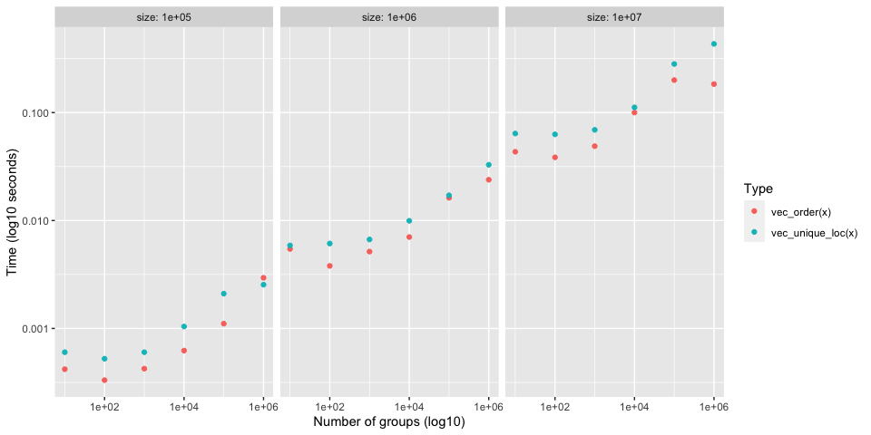
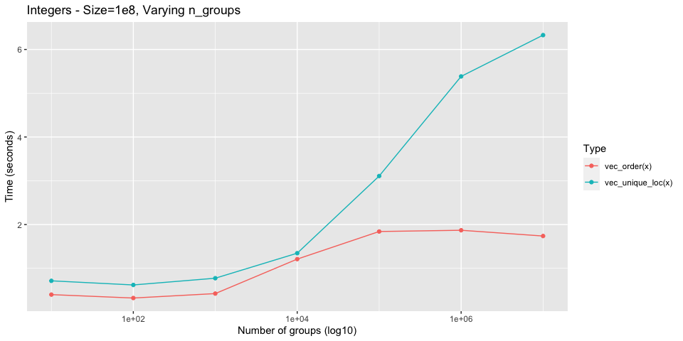

Sorting vs Hashing
================

Investigates performance of `vec_order()` vs current implementation of
`vec_unique()`, which is based on hashing and a dictionary. It might be
worth switching to use the sort based approach of `vec_order()`.

## Setup

``` r
library(vctrs)
library(rlang)
library(stringr)
library(ggplot2)
library(dplyr)
```

``` r
# Generate `size` random words of varying string sizes
new_dictionary <- function(size, min_length, max_length) {
  lengths <- rlang::seq2(min_length, max_length)

  stringi::stri_rand_strings(
    size,
    sample(lengths, size = size, replace = TRUE)
  )
}
```

``` r
# Work around bench_expr bug where vectorized attribute isn't being sliced
# https://github.com/r-lib/bench/pull/90

filter_bench <- function(.data, ...) {
  out <- dplyr::mutate(.data, rn = row_number()) %>%
    dplyr::filter(...)
  
  # patch up bench_expr
  which <- out$rn
  desc <- attr(.data$expression, "description")
  attr(out$expression, "description") <- desc[which]
  
  out$rn <- NULL
  
  out
}
```

``` r
plot_bench <- function(df, title = waiver()) {
  df %>%
    ggplot(aes(x = n_groups, y = as.numeric(median))) +
    geom_point(aes(color = as.character(expression))) +
    facet_wrap(~ size, labeller = label_both, nrow = 1) +
    scale_x_log10() +
    scale_y_log10() + 
    labs(
      x = "Number of groups (log10)",
      y = "Time (log10 seconds)",
      color = "Type",
      title = title
    )
}
```

## Compare with `vec_unique_loc()`

It is worth comparing to `vec_unique_loc()`, which is the most bare
bones of the uniqueness functions, to test whether or not
uniqueness-by-sorting can be faster than uniqueness-by-hashing.

In a branch, I hacked together an implementation of `vec_unique_loc()`
based on `vec_order()`. It takes approximately the same amount of time
as `vec_order()` itself, so I will just use `vec_order()` as a proxy for
the sorting approach.

### Test 1

  - Integers
  - Varying total size (small)
  - Varying group size

<!-- end list -->

``` r
set.seed(123)

size <- 10 ^ (1:4)
n_groups <- 10 ^ (1:6)

df <- bench::press(
  size = size,
  n_groups = n_groups,
  {
    x <- sample(n_groups, size, replace = TRUE)
    bench::mark(
      vec_order(x), vec_unique_loc(x), 
      iterations = 100, check = FALSE
    )
  }
)
```

Performance is generally the same for small sizes

<!-- -->

However, `size = 10000` seems to already show `vec_order()` being
faster.

``` r
df[-1] %>%
  filter(size == 10000)
#>  # A tibble: 12 x 7
#>      size n_groups      min   median `itr/sec` mem_alloc `gc/sec`
#>     <dbl>    <dbl> <bch:tm> <bch:tm>     <dbl> <bch:byt>    <dbl>
#>   1 10000       10   38.3µs   51.8µs    19679.    39.1KB      0  
#>   2 10000       10   83.5µs     88µs    11173.   104.2KB      0  
#>   3 10000      100   33.5µs   49.2µs    19908.    39.1KB      0  
#>   4 10000      100   58.1µs   90.1µs    10972.   104.7KB      0  
#>   5 10000     1000   52.4µs   55.5µs    16933.    39.1KB      0  
#>   6 10000     1000   64.5µs  109.7µs     9468.   114.3KB      0  
#>   7 10000    10000     85µs    100µs     9817.    39.1KB      0  
#>   8 10000    10000  166.8µs    226µs     4553.     191KB      0  
#>   9 10000   100000  206.9µs  225.2µs     4343.    39.1KB      0  
#>  10 10000   100000  190.1µs  257.2µs     3912.   267.7KB     39.5
#>  11 10000  1000000  187.2µs    201µs     4867.   174.3KB      0  
#>  12 10000  1000000  168.7µs  202.3µs     4744.   269.4KB     47.9
```

### Test 2

  - Integers
  - Varying total size (large)
  - Varying number of groups

<!-- end list -->

``` r
set.seed(123)

size <- 10 ^ (5:7)
n_groups <- 10 ^ (1:6)

df <- bench::press(
  size = size,
  n_groups = n_groups,
  {
    x <- sample(n_groups, size, replace = TRUE)
    bench::mark(
      vec_order(x), vec_unique_loc(x), 
      iterations = 20, check = FALSE
    )
  }
)
```

As the total size increases, `vec_order()` starts to do better.

<!-- -->

In particular, if you get to around 10,000,000 values and increase the
number of groups past the counting sort range, you really see the
benefits of the radix sort kick in.

``` r
set.seed(123)

size <- 10 ^ 7
n_groups <- c(1e6, seq(2e6, 1e7, by = 2e6))

df <- bench::press(
  n_groups = n_groups,
  {
    x <- sample(n_groups, size, replace = TRUE)
    bench::mark(
      vec_order(x), vec_unique_loc(x), 
      iterations = 20, check = FALSE
    )
  }
)
```

<!-- -->

### Test 3

Currently string ordering is much slower than `vec_unique_loc()`
(especially when most strings are unique) due to all of the allocations
that are required + the fact that it does a radix ordering of unique
strings and then an integer radix ordering after that.

I am confident that the C level part of `vec_order()` could gain a
`sort_character = false` option that would do a much faster counting
sort in order-of-first-appearance that utilizes the truelengths in a
different way. It wouldn’t sort strings at all, so should be very fast.
This is what `cgroup()` does in `base::order()`, which is not currently
implemented in `vec_order()` because I didn’t have a use for it until
now.
<https://github.com/wch/r-source/blob/8d7ac4699fba640d030703fa010b66bf26054cbd/src/main/radixsort.c#L1051>

Very large set of strings with 10 groups

  - Don’t notice much of a difference between the two here, because
    there aren’t many unique strings.

<!-- end list -->

``` r
set.seed(123)

size <- 1e7
n_groups <- 10

dict <- new_dictionary(n_groups, min_length = 5, max_length = 20)
x <- sample(dict, size, TRUE)

bench::mark(vec_order(x), vec_unique_loc(x), iterations = 10, check = FALSE)
#>  # A tibble: 2 x 6
#>    expression             min   median `itr/sec` mem_alloc `gc/sec`
#>    <bch:expr>        <bch:tm> <bch:tm>     <dbl> <bch:byt>    <dbl>
#>  1 vec_order(x)        81.9ms     95ms      10.8     124MB     16.2
#>  2 vec_unique_loc(x)     87ms   89.8ms      11.2     102MB     11.2
```

Very large set of completely random strings

  - Extremely large difference, because `vec_order()` is doing way too
    much work to actually sort the strings.

<!-- end list -->

``` r
set.seed(123)

n_groups <- 1e7

x <- new_dictionary(n_groups, min_length = 5, max_length = 20)

bench::mark(vec_order(x), vec_unique_loc(x), iterations = 10, check = FALSE)
#>  # A tibble: 2 x 6
#>    expression             min   median `itr/sec` mem_alloc `gc/sec`
#>    <bch:expr>        <bch:tm> <bch:tm>     <dbl> <bch:byt>    <dbl>
#>  1 vec_order(x)         5.64s     6.1s     0.150     856MB    0.330
#>  2 vec_unique_loc(x)    1.15s    1.49s     0.670     268MB    0.335
```
