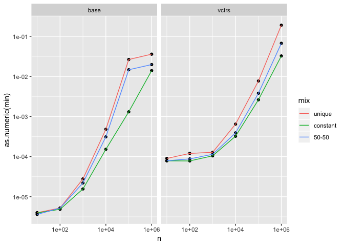
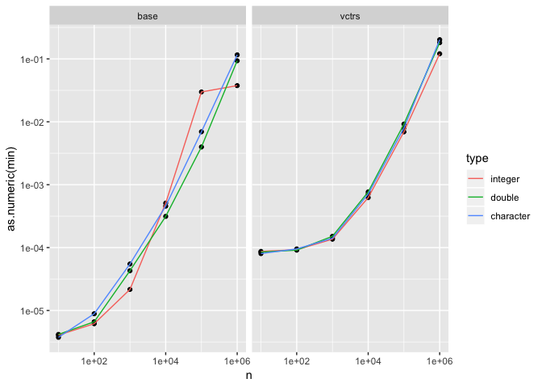
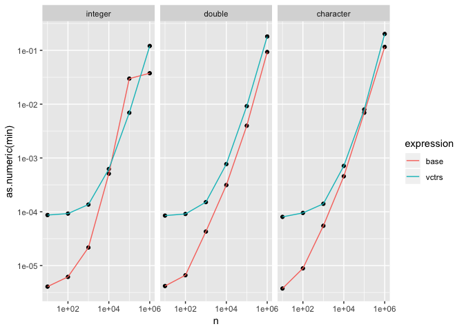
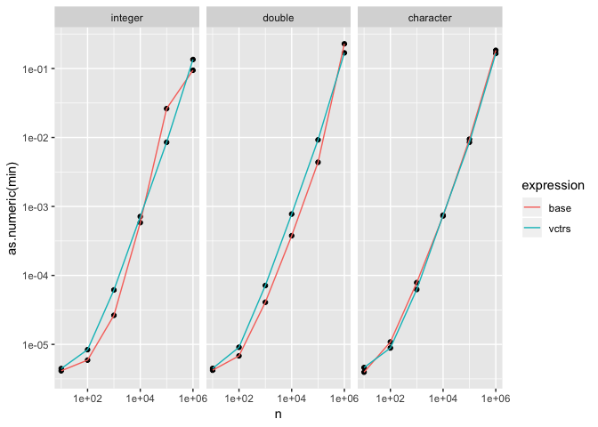

Unique performance
================

Exploration of the performance of unique as a proxy for the performance
of the underlying dictionary + hash code.

``` r
library(tidyverse)
library(vctrs)
library(bench)

make_vec <- function(type, n, mix) {
  x <- switch(as.character(mix),
    unique = 1:n,
    constant = rep(0L, n),
    "50-50" = c(1:(n/2), rep(0L, n / 2))
  )
  
  as.vector(x, as.character(type))
}
```

## Proportion of uniqueness

``` r
df <- bench::press(
  n = c(1e1, 1e2, 1e3, 1e4, 1e5, 1e6),
  mix = c("unique", "constant", "50-50"),
  {
    x <- make_vec("integer", n, mix)
    bench::mark(
      base = unique(x),
      vctrs = vec_unique(x),
      min_time = 0.05
    )
  }
)
```

Relatively small difference. Unsurprisingly, unique is the worst case,
so I’ll just only use that going forward.

<!-- -->

## Performance by type

``` r
df <- bench::press(
  type = c("integer", "double", "character"),
  n = c(1e1, 1e2, 1e3, 1e4, 1e5, 1e6),
  {
    x <- make_vec(type, n, "unique")
    bench::mark(
      base = unique(x),
      vctrs = vec_unique(x),
      min_time = 0.05,
      max_iterations = 20
    )
  }
)
```

<!-- -->

Let’s compare head-to-head with base. Clearly there’s some larger setup
cost needed for vctrs dictionary, and the performance difference
declines as size increases.

<!-- -->

## Raw C code

If we just call the C function that underlies `vec_unique()`
(i.e. ignoring the code that makes these functions generic) we see very
little performance difference:

``` r
df <- bench::press(
  type = c("integer", "double", "character"),
  n = c(1e1, 1e2, 1e3, 1e4, 1e5, 1e6),
  {
    x <- make_vec(type, n, "unique")
    bench::mark(
      base = unique(x),
      vctrs = .Call(vctrs:::vctrs_unique_loc, x),
      min_time = 0.05,
      max_iterations = 20,
      check = FALSE
    )
  }
)
```

<!-- -->
