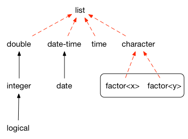
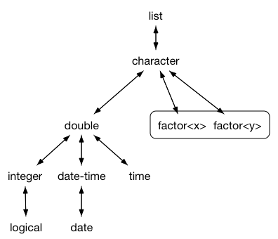

```{r, include = FALSE}
knitr::opts_chunk$set(
  collapse = TRUE,
  comment = "#>"
)
set.seed(1014)
```

This vignette shows you how to create your own S3 vector classes. It focusses on the aspects of making a vector class that every class needs to worry about; you'll also need to provide methods that actually make the vector useful.

```{r setup}
library(vctrs)
```

This vignette will work through a few different types of vector:

* Percent: a simple class that changes the display of a numeric vector, but
  not its calculation. This will help you get familiar with the basics of 
  vctrs. I recommend that every read this section, before picking up choosing
  from the following sections based on the type of vector you'll need.
  
* Decimal: a numeric class that always shows a fixed number of decimal places.
  We'll store the number of decimal places in an attribute.
  
* Cached sum: a numeric vector that caches the total sum in an attribute. This
  will show you how handle an attribute that is dependent on the data.

* Rational: a pair of integer vectors that defines a rational number (i.e. a 
  fraction).

This vignette shows you the basic infrastructure for creating a new vector: defining low-level and user-facing constructor functions, providing a `format()` method, and defining casting and coercion methods. This gets you quite a long way because vctrs provides many S3 methods build from these primitives. For example:

* `print()` and `str()` methods are defined in terms of `format()` so you get
  uniformly nice display as soon as you've made your `format()` method.
  
* You can immediately put your new vector class in a data frame because 
  vctrs provided the tricky `as.data.frame()` for you.

* Subsetting (`[`, `[[`, `$`), `length<-`, and `rep()` methods automatically
  preserve attributes because they're built on top of `vec_restore()`. A 
  default `vec_restore()` works for all classes where the attributes are 
  data-independent, and can easily be customised when the attributes do depend
  on the data.

* Subset-assignment methods (`[<-`, `[[<-`, `$<-`) are implemented based on the
  principle that the new values should be coerced to the same type as the 
  existing vector. This gives predictable behaviour and clear error messages.

## Basics

### Percent class

In this section, I'll show you how to make a "percent" class, i.e. a double vector that is printed like it's a percentage. This is a good place to start because it's the simplest possible S3 class as it has no custom attributes.

```{r, eval = FALSE}
percent(c(0, 0.5, 1))
#> <percent[3]>
#> [1]   0%  50% 100%
```

### Low-level constructor

All classes should have a low-level constructor called `new_class()` that checks types (but not values), then calls `new_vctr()`.  This function is designed for developers: it should be high performance so that it can be called from other functions.

The percent class is very simple, it's constructor takes only a single input, which must be a double vector. Note that we prefix the name of the class with the name of the package. This prevents conflicting definitions between packages.

```{r}
new_percent <- function(x) {
  stopifnot(is.double(x))
  new_vctr(x, class = "vctrs_percent")
}

x <- new_percent(c(seq(0, 1, length = 4), NA))

x

str(x)
```

If you want your class to be extensible, you need to include `...` and `class` in your low-level constructor:

```{r}
new_percent <- function(x, ..., class = character()) {
  stopifnot(is.double(x))
  new_vctr(x, ..., class = c(class, "vctrs_percent"))
}
```

You need to carefully decide if it's worthwhile to make your class extensible, as it will make the implementation of other methods more complex, since you only know the inputs contain at least the specified attributes; they may contain more if it's a subclass.

### `format()` method

The first method for every class should almost always be a `format()` method. This should return a character vector the same length as `x`. The easiest way to do this is to rely on one of R's low-level formatting functions like `formatC()`:

```{r}
format.vctrs_percent <- function(x, ...) {
  out <- formatC(signif(vec_data(x) * 100, 3))
  out[is.na(x)] <- NA
  out[!is.na(x)] <- paste0(out[!is.na(x)], "%")
  out
}
```

```{r, include = FALSE}
# As of R 3.5, print.vctr can not find format.percent since it's not in
# it's lexical environment. We fix that problem by manually registering.
s3_register("base::format", "vctrs_percent")
```

```{r}
x
```

(Note that we take a little care to not convert `NA` to `"NA"`; this leads to better printing.)

The format method is also used by data frames, tibbles, and `str()`:

```{r}
data.frame(x)
```

For optimal display, I recommend also defining an abbreviated type name, which should be 4-5 letters for commonly used vectors. This is used in tibbles and in `str()`:

```{r}
vec_ptype_abbr.vctrs_percent <- function(x) {
  "pcnt"
}

tibble::tibble(x)

str(x)
```

If you need more control over printing in tibbles, implement a method for  `pillar::pillar_shaft()`. See <https://tibble.tidyverse.org/articles/extending.html> for details.

### Default methods

The vctr base class provides implementations of many important generics so that you don't have to. This means that many functions will work out of the box without any additional effort on your part:

```{r}
x[1:2]

x[[1]]

sqrt(x)
```

### User-friendly constructor

Next, implement a user friendly constructor called `myclass()`. It should carefully check that the input is valid and provide human readable messages. This constructor will typically use `vec_cast()` to helpfully coerce inputs to the correct type.

```{r}
percent <- function(x = double()) {
  x <- vec_cast(x, double())
  new_percent(x)
}
```

Before you go on, check that user-friendly constructor returns a zero-length vector when called with no arguments. This makes it easy to use as a prototype. 

```{r}
percent()
```

## Casting and coercion

### Coercions

`vec_type2()` defines the possible set of automatic (implicit) coercions. These coercions happen silently, so they should be quite strict; if they're too flexible, they increase the chance of silently propagating mistakes. To think about what coercions your class should provide, it's useful to look at coercions that vctrs provides for base types:

```{r, echo = FALSE}

```

If you squint your brain a little, I think you can see that each set of automatic coercions is about increasing resolution. Integers are low resolution versions of doubles, and dates are low resolution versions of date-times. Logicals are low resolution version of integers because there's a strong convention that `TRUE` and `FALSE` can be used interchangeably with `1` and `0`. 

But what is the resolution of a factor? We must take a somewhat pragmatic approach because base R often converts character vectors to factors, and we don't want to be burdensome to users. So we say that a factor `x` has finer resolution than factor `y` if the levels of `y` are contained in `x`. So to find the common type of two factors, we take the union of the levels of both factors, resulting in a factor that has finer resolution than either. Finally, you can think of a character vector as a factor with every possible level, so factors and character vectors are coercible.

I expect that most custom classes will be coercible to only a couple of other classes at most.

### Casts

`vec_cast()` defines the possible set user-requested coercions, known as __casts__. Because these are user initiated, the set of possible casts is much larger than the set of possible coercions. The following diagram shows the set of casts that vctrs provides for base classes. If you can follow arrows in the same direction from one class to another, then a cast exists.

```{r, echo = FALSE}

```

Note that the arrows are bidirectional: if you can cast from `x` to `y`, you should also be able to cast back from `y` to `x`. 

If type `x` has greater resolution than `y`, there will be some inputs that lose precision. These should generate warnings using `warn_lossy_cast()`. You can see that in action when casting from doubles to integers; only some doubles can become integers without losing resolution.

```{r}
vec_cast(c(1, 2, 10), to = integer())

vec_cast(c(1.5, 2, 10.5), to = integer())
```

Generally, you should provide a cast method whenever it's meaningful to cast back and forth from a given type. 


### Percent class {#percent}


Next, define possible casts between your vector and existing types. You do this by providing methods for `vec_cast()`. `vec_cast()` is a little unusual because the result depends on the type of both arguments: the input `x`, and the target type `to`. Techically, this means that we need __double dispatch__, which is described in detail in `vignette("double-dispatch")`. S3 does not natively support double dispatch, but we can implement with a trick: doing single dispatch twice.  Here we'll focus on the practicalities, giving you a recipe to follow for your class.

First, we create a new generic, and provide two standard methods:

* `vec_cast.vctrs_percent.default()` ensures that the default behaviour is 
  to throw an informative error message.
  
* `vec_cast.vctrs_percent.logical()` ensures that you class works when
  combined with `NA`. Technically, NA has class logical, but we want to be
  able to use it as a type-less specifier that works with all vectors.

These are required for every class; you can just copy and paste this block, replacing `percent` with the name of your class.

```{r, error = TRUE}
vec_cast.vctrs_percent <- function(x, to) UseMethod("vec_cast.vctrs_percent")
vec_cast.vctrs_percent.default <- function(x, to) stop_incompatible_cast(x, to)
vec_cast.vctrs_percent.logical <- function(x, to) vec_unspecified_cast(x, to)

vec_cast(character(), x)
vec_cast(NA, percent())
```
```{r, include = FALSE}
s3_register("vctrs::vec_cast", "vctrs_percent")
```

You also need to provide a method to coerce one percent object to match the attributes of another. This is very simple because percent objects have no attributes, but it will more complicated for more complex object types.

```{r}
vec_cast.vctrs_percent.vctrs_percent <- function(x, to) x
```

Next we provide some useful methods to coerce percents back and forth with doubles:

```{r}
vec_cast.vctrs_percent.double <- function(x, to) percent(x)
vec_cast.double.vctrs_percent <- function(x, to) vec_data(x)

vec_cast(0.5, percent())
vec_cast(percent(0.5), double())
```

And then with integers. Note that I use `vec_cast()` on the underlying vector (`vec_data()`) in order to get the nice default behaviour which reports when we lose precision:

```{r}
vec_cast.vctrs_percent.integer <- function(x, to) percent(x / 100)
vec_cast.integer.vctrs_percent <- function(x, to) vec_cast(vec_data(x) * 100, integer())

vec_cast(c(100L, 50L), percent())
vec_cast(percent(c(0.5, 1)), integer())
```

These methods power `[[<-` and `[<-`, because the vctrs default coerces the `value` to the same type as `x`.

```{r, error = TRUE}
x[1] <- 2
x

x[[1]] <- "x"
```

Finally, we define methods for `vec_type2()` which tells vctrs when it is ok to perform automatic (aka implicit) coercion: given a pair of prototypes, it should either return their common type or throw an error.

`vec_type2()` also uses double-dispatch, so we start off with a recipe:

```{r}
vec_type2.vctrs_percent <- function(x, y) UseMethod("vec_type2.vctrs_percent")
vec_type2.vctrs_percent.default           <- function(x, y) stop_incompatible_type(x, y)
vec_type2.vctrs_percent.vctrs_unspecified <- function(x, y) x
vec_type2.vctrs_percent.vctrs_percent     <- function(x, y) x
```

```{r, include = FALSE}
s3_register("vctrs::vec_type2", "vctrs_percent")
```

Next we define methods that say it's ok to automatically coerce double and integer vectors to percents.

```{r}
vec_type2.vctrs_percent.double  <- function(x, y) percent()
vec_type2.double.vctrs_percent  <- function(x, y) percent()
vec_type2.vctrs_percent.integer <- function(x, y) percent()
vec_type2.integer.vctrs_percent <- function(x, y) percent()
```

If you're unsure about what methods to provide here, err on the side of caution: too many implicit coercions make code hard to understand.

Implementing casting gives you more methods for free:

```{r}
vec_c(x, 1)

x[1] <- 1
```

However, you can assume any function beginning with `vec()` will handle these coercions correctly.

### Decimal class

Now that you've seen the basics with a very simple S3 class, we'll gradually explore more complicated scenarios. This section creates a `decimal` class that always prints with the specified number of decimal places. This is very similar to `percent` but now the class needs an attribute: the number of decimal places to display.

We start of as before, defining a low-level constructor, a user-friendly constructor, a `format()` method, and a `vec_ptype_abbr()`. Note that additional object attributes are simply passed along to `new_vctr()`:

```{r}
new_decimal <- function(x = double(), digits = 2L) {
  stopifnot(is.double(x))
  stopifnot(is.integer(digits), length(digits) == 1)
  
  new_vctr(x, digits = digits, class = "vctrs_decimal")
}

decimal <- function(x = double(), digits = 2L) {
  x <- vec_cast(x, double())
  digits <- vec_cast(digits, integer())
  if (length(digits) != 1) {
    stop("`digits` must be length 1", call. = FALSE)
  }
  
  new_decimal(x, digits = digits)
}

digits <- function(x) attr(x, "digits")

format.vctrs_decimal <- function(x, ...) {
  sprintf(paste0("%-0.", digits(x), "f"), x)
}

vec_ptype_abbr.vctrs_decimal <- function(x) {
  paste0("dec")
}

x <- decimal(runif(10), 1L)
x
```

Note that I provide a little helper to extract the `digits` attribute. This makes the code a little easier to read, and should not be exported.

By default, vctrs assumes that attributes are independent of the data, and so are automatically preserved. You'll see what to do if the attributes are data dependent in the next section.

```{r}
x[1:2]
x[[1]]
```

For the sake of exposition, we'll assume that `digits` is an important attribute of the class, and should be included in the full type:

```{r}
vec_ptype_full.vctrs_decimal <- function(x) {
  paste0("decimal<", digits(x), ">")
}

x
```

Now consider `vec_cast()` and `vec_type2()`. I start with the standard recipes:

```{r}
vec_type2.vctrs_decimal <- function(x, y) UseMethod("vec_type2.vctrs_decimal")
vec_type2.vctrs_decimal.default <- function(x, y) stop_incompatible_type(x, y)
vec_type2.vctrs_decimal.vctrs_unspecified <- function(x, y) x

vec_cast.vctrs_decimal <- function(x, to) UseMethod("vec_cast.vctrs_decimal")
vec_cast.vctrs_decimal.default <- function(x, to) stop_incompatible_cast(x, to)
vec_cast.vctrs_decimal.logical <- function(x, to) vec_unspecified_cast(x, to)
```

Casting and coercing from one decimal to another requires a little thought as the values of the `digits` attribute might be different, and we need some way to reconcile them. Here I've chosen to chose the maximum of the two, but for your class you might chose the left-hand side or throw an error.

```{r}
vec_type2.vctrs_decimal.vctrs_decimal <- function(x, y) {
  new_decimal(digits = max(digits(x), digits(y)))
}
vec_cast.vctrs_decimal.vctrs_decimal <- function(x, to) {
  new_decimal(vec_data(x), digits = digits(to))
}

vec_c(decimal(1/100, digits = 3), decimal(2/100, digits = 2))
```

Finally, I can implement coercion to and from other types, like doubles. When automatically coercing, I choose the richer type (i.e. the decimal).

```{r}
vec_type2.vctrs_decimal.double <- function(x, y) x
vec_type2.double.vctrs_decimal <- function(x, y) y

vec_cast.vctrs_decimal.double  <- function(x, to) new_decimal(x, digits = digits(to))
vec_cast.double.vctrs_decimal  <- function(x, to) vec_data(x)

vec_c(decimal(1, digits = 1), pi)
vec_c(pi, decimal(1, digits = 1))
```

### Cached sum class {#cached-sum}

The next level up in complexity is an object that has data-dependent attributes. To explore this idea we'll create a vector that caches the sum of its values. As usual, we start with low-level and user-friendly constructors:

```{r}
new_cached_sum <- function(x = double(), sum = 0L) {
  stopifnot(is.double(x))
  stopifnot(is.double(sum), length(sum) == 1L)
  
  new_vctr(x, sum = sum, class = "vctrs_cached_sum")
}

cached_sum <- function(x) {
  x <- vec_cast(x, double())
  new_cached_sum(x, sum(x))
}
```

For this class, we don't need to provide a method for `format()`. Instead, we'll provide a method for `obj_print_footer()` that prints the sum:

```{r}
obj_print_footer.vctrs_cached_sum <- function(x, ...) {
  cat("# Sum: ", format(attr(x, "sum"), digits = 3), "\n", sep = "")
}

x <- cached_sum(runif(10))
x
```

As mentioned above, vctrs assumes that attributes are independent of the data. This means that when we take advantage of the default methods, they'll work, but return the incorrect result:

```{r}
x[1:2]
```

To fix this, you need to provide a `vec_restore()` method. Note that this method dispatches on the `to` argument.

```{r}
vec_restore.vctrs_cached_sum <- function(x, to) {
  new_cached_sum(x, sum(x))
}

x[1]
```

This works because most of the vctrs methods dispatch to the underlying base function, by first stripping off extra attributes with `vec_data()` and then reapplying them again with `vec_restore()`. The default `vec_restore()` method copies over all attributes, which is not appropriate here.

Note that `vec_restore.class` is subtly different from `vec_cast.class.class()`. `vec_restore()` is used when restoring attributes that have been lost; `vec_cast()` is used for coercions. This is easier to understand with a concrete example. Imagine factors were implements with `new_vectr()`. `vec_restore.factor()` would restore attributes back to an integer vector, but you would not want to allow manually casting an integer to a factor with `vec_cast()`. 


## Records

### Rational

A fraction, or rational number can be represented by a pair of integer vectors representing the numerator (the number on top) and the denominator (the number on bottom), where the length of each vector must be the same. To represent such a data structure we turn to a new base data type: the record (or rcrd for short).

As usual we start with low-level and user-friendly constructors. The low-level constructor calls `new_rcrd()` which expects a named list of equal-length vectors (and will error if given anything else).

```{r}
new_rational <- function(n = integer(), d = integer()) {
  stopifnot(is.integer(n))
  stopifnot(is.integer(d))
  
  new_rcrd(list(n = n, d = d), class = "vctrs_rational")
}
```

In our user friendly constructor as well as casting `n` and `d` to the desired type, we also recycle them to the same length.

```{r}
rational <- function(n, d) {
  c(n, d) %<-% vec_cast_common(n, d, .to = integer())
  c(n, d) %<-% vec_recycle_common(n, d)
  
  new_rational(n, d)
}

x <- rational(1, 1:10)
```

Behind the scenes, `x` is a named list with two elements. But to behave like a vector, those details are hidden:

```{r}
names(x)
length(x)
```

To access the underlyings we need to use `field()` and `fields()`:

```{r}
fields(x)
field(x, "n")
```

Which allows us to create a format method:

```{r}
format.vctrs_rational <- function(x, ...) {
  n <- field(x, "n")
  d <- field(x, "d")
  
  out <- paste0(n, "/", d)
  out[is.na(n) | is.na(d)] <- NA
  
  out
}

vec_ptype_abbr.vctrs_rational <- function(x) "rtnl"
vec_ptype_full.vctrs_rational <- function(x) "rational"

x
```

vctrs also uses this method in `str()`, hiding the underlying implementation details from the user:

```{r}
str(x)
```

Implementing `vec_ptype()` and `vec_cast()` is straightforward following the existing recipes of `percent()`. If the class has additional attributes, follow the recipe of `decimal()`. If the attributes, vary based on the data, follow the recipe of `cached_sum()`.

```{r}
vec_type2.vctrs_rational <- function(x, y) UseMethod("vec_type2.vctrs_rational", y)
vec_type2.vctrs_rational.default <- function(x, y) stop_incompatible_type(x, y)
vec_type2.vctrs_rational.vctrs_rational <- function(x, y) x

vec_cast.vctrs_rational <- function(x, to) UseMethod("vec_cast.vctrs_rational")
vec_cast.vctrs_rational.default <- function(x, to) stop_incompatible_cast(x, y)
vec_cast.vctrs_rational.vctrs_rational <- function(x, to) x
```


## Equality and comparison

vctrs provides two "proxy" generics that allow you to declare that your class have possesses certain properties. A proxy function returns a simple object (typically either a bare vector or a data frame), that possesses the same properties as your class. This permits efficient implementation of the vctrs internals because once you have the proxy object, all code can be written in C.

* `vec_proxy_equal()` specifies how to test the elements of your for equality. 
  This proxy underpins `==` and `!=`, but also `unique()`, `anyDuplicated()`, 
  and `is.na()`.

* `vec_proxy_compare()` specifies how to compare the elements of your vector.
  This proxy is used in `<`, `<=`, `>=`, `>`, `min()`, `max()`, `median()`, 
  `quantile()`, and `xtfrm()` methods. (And `xtfrm()` is used in `order()` and 
  `sort()`.)

Where possible, it's a good idea to define methods for these generics because you get a lot of behaviour for relatively little work.

### Rational class

By default, `vec_proxy_equal()` converts a record to a data frame:

```{r}
x <- rational(c(1, 2, 1, 2), c(1, 1, 2, 2))
x

vec_proxy_equal(x)
```

And the default comparison is column by column:

```{r}
x == rational(1, 1)
```

This is an ok default, but doesn't do exactly what we want here because `rational(1, 1)` represents the same number as `rational(2, 2)` so they should be equal. We can fix that by dividing `n` and `d` by their greatest common divisor:

```{r}
# Thanks to Matthew Lundberg: https://stackoverflow.com/a/21504113/16632 
gcd <- function(x, y) {
  r <- x %% y
  ifelse(r, gcd(y, r), y)
}

vec_proxy_equal.vctrs_rational <- function(x) {
  n <- field(x, "n")
  d <- field(x, "d")
  gcd <- gcd(n, d)
  
  data.frame(n = n / gcd, d = d / gcd)
}
vec_proxy_equal(x)

x == rational(1, 1)
```

Again, the default comparison proxy is just the elements:

```{r}
vec_proxy_compare(x)
```
So sorting doesn't give us increasing order:

```{r}
sort(x)
```

Here the easiest fix is to simply compute the fraction and then sort that real number:

```{r}
vec_proxy_compare.vctrs_rational <- function(x) {
  field(x, "n") / field(x, "d")
}

sort(x)
```

(We could have used that technique for equality, but due to floating point computation it's not necessarily true that `x == y` implies that `d * x == d * y`.)

### Polynomial class

```{r}
new_poly <- function(x) {
  new_list_of(x, ptype = integer(), class = "vctrs_poly")
}

poly <- function(...) {
  x <- list(...)
  x <- lapply(x, vec_cast, integer())
  new_poly(x)
}

vec_ptype_full.vctrs_poly <- function(x) "polynomial"
vec_ptype_abbr.vctrs_poly <- function(x) "poly"

format.vctrs_poly <- function(x, ...) {
  format_one <- function(x) {
    if (length(x) == 0) {
      return("")
    } else if (length(x) == 1) {
      format(x)
    } else {
      suffix <- c(paste0("\u22C5x^", seq(length(x) - 1, 1)), "")
      out <- paste0(x, suffix)
      out <- out[x != 0L]
      paste0(out, collapse = " + ")
    }
  }
  vapply(x, format_one, character(1))
}

obj_print_data.vctrs_poly <- function(x) {
  if (length(x) == 0)
    return()
  print(format(x), quote = FALSE)
}

p <- poly(1, c(1, 0, 1), c(1, 0, 0, 0, 2))
p
```

Equality works out of the box because we can tell if two integer vectors are equal:

```{r}
p == poly(c(1, 0, 1))
```

But we can't order them, because lists are not comparable:

```{r, error = TRUE}
sort(p)
```

So we need to define a `vec_proxy_compare()` method:

```{r}
vec_proxy_compare.vctrs_poly <- function(x) {
  x_raw <- vec_data(x)
  # First figure out the maximum length
  n <- max(vapply(x_raw, length, integer(1)))
  
  # Then expand all vectors to this length by filling in with zeros
  full <- lapply(x_raw, function(x) c(rep(0L, n - length(x)), x))
  
  # Then turn into a data frame
  as.data.frame(do.call(rbind, full))
}

sort(poly(3, 2, 1))
sort(poly(1, c(1, 0, 0), c(1, 0)))
```

## Arithmetic

vctrs also provides two mathematical generics that allow you to define a broad swath of mathematical behaviour at once:

*  `vec_math()` specifies the behaviour of mathematical functions like 
   `abs()`, `sum()`, and `mean()`.
   
*  `vec_arith()` specifies the behaviour of the arithmetic operations like
   `+`, `-`, and `%%`.

### Interval class

First, we implement an interval class, a record composed of `l`eft and `r`ight fields. As usual, we make a low-level constructor, a user-friend constructor, and define a format method.

```{r}
new_interval <- function(l, r) {
  stopifnot(is.double(l), is.double(r))
  new_rcrd(list(l = l, r = r), class = "vctrs_interval")
}
interval <- function(l, r) {
  c(l, r) %<-% vec_cast_common(l, r, .to = double())
  c(l, r) %<-% vec_recycle_common(l, r)
  c(l, r) %<-% list(pmin(l, r), pmax(l, r))
  new_interval(l, r)
}
format.vctrs_interval <- function(x, ...) {
  l <- field(x, "l")
  r <- field(x, "r")
  
  out <- paste0("[", format(l), ",", format(r), "]")
  out[is.na(x)] <- NA
  out
}

x <- new_interval(c(0.25, 0.5, 0.75, NA), c(0.5, 1.5, 2, NA))
x
```

Arithmetic operations are provided by a single generic, `vec_arith()`, which like `vec_cast()` and `vec_type2()`, uses double dispatch. That means we start with some boilerplate:

```{r}
vec_arith.vctrs_interval <- function(op, x, y) {
  UseMethod("vec_arith.vctrs_interval", y)
}
vec_arith.vctrs_interval.default <- function(op, x, y) {
  stop_incompatible_op(op, x, y)
}
```

First, we'll implement a method two intervals. <https://en.wikipedia.org/wiki/Interval_arithmetic#Simple_arithmetic>

```{r}
vec_arith.vctrs_interval.vctrs_interval <- function(op, x, y) {
  c(x, y) %<-% vec_recycle_common(x, y)
  
  x1 <- field(x, "l"); x2 <- field(x, "r")
  y1 <- field(y, "l"); y2 <- field(y, "r")
  
  switch(op,
    "+" = new_interval(x1 + y1, x2 + y2),
    "-" = new_interval(xl - y2, x2 - y1),
    "*" = new_interval(
      pmin(x1 * y1, x1 * y2, x2 * y1, x2 * y2), 
      pmax(x1 * y1, x1 * y2, x2 * y1, x2 * y2)
    ),
    stop_incompatible_op(op, x, y)
  )
}

x + interval(0, 1)

x * interval(0, 1)
x * interval(1, 2)
```

```{r}
vec_arith.vctrs_interval.double <- function(op, x, y) {
  c(x, y) %<-% vec_recycle_common(x, y)
  
  l <- vec_arith_base(op, field(x, "l"), y)
  r <- vec_arith_base(op, field(x, "r"), y)
  
  new_interval(pmin(l, r), pmax(l, r))
}

x + 1
x / 2
x * -2 
```

```{r}
vec_arith.numeric.vctrs_interval <- function(op, x, y) {
  c(x, y) %<-% vec_recycle_common(x, y)
  
  l <- vec_arith_base(op, x, field(y, "l"))
  r <- vec_arith_base(op, x, field(y, "r"))
  
  new_interval(pmin(l, r), pmax(l, r))
}

1 + x
2 / x 
-2 * x 
```

(Note that this implementation prevents subclassing because we explicitly call `new_interval()`. If you wanted to support subclassing, you'd need to carefully think about how to use `vec_restore()`.)

```{r}
vec_arith.vctrs_interval.MISSING <- function(op, x, y) {
  switch(op, 
    `-` = x * -1,
    `+` = x,
    stop_incompatible_op(op, x, y)
  )
}
-x 
+x
```

### Period and frequency classes

```{r}
period <- function(x) {
  x <- vec_cast(x, double())
  new_vctr(x, class = "vctrs_period")
}
format.vctrs_period <- function(x) {
  paste0(format(vec_data(x)), " s")
}

freq <- function(x) {
  x <- vec_cast(x, double())
  new_vctr(x, class = "vctrs_frequency")
}
format.vctr_frequency <- function(x) {
  paste0(format(vec_data(x)), " Hz")
}

period(0.1)
freq(10)
```


```{r}
vec_arith.vctr_frequency <- function(op, x, y) {
  UseMethod("vec_arith.vctr_frequency", y)
}
vec_arith.vctrs_frequency.default <- function(op, x, y) {
  stop_incompatible_op(op, x, y)
}
vec_arith.vctrs_period <- function(op, x, y) {
  UseMethod("vec_arith.vctrs_period", y)
}
vec_arith.vctrs_period.default <- function(op, x, y) {
  stop_incompatible_op(op, x, y)
}
```

```{r}
vec_arith.vctrs_period.vctrs_period <- function(op, x, y) {
  switch(op,
    `-` = ,
    `+` = vec_restore(vec_arith_base(op, x, y), x),
    stop_incompatible_op(op, x, y)
  )
}
vec_arith.vctrs_period.numeric <- function(op, x, y) {
  switch(op,
    `-` = ,
    `+` = ,
    `*` = ,
    `/` = vec_restore(vec_arith_base(op, x, y), x),
    stop_incompatible_op(op, x, y)
  )
}
vec_arith.numeric.vctrs_period <- function(op, x, y) {
  switch(op,
    `*` = vec_restore(vec_arith_base(op, x, y), y),
    `/` = freq(vec_arith_base(op, x, y)),
    stop_incompatible_op(op, x, y)
  )
}

period(1) + period(1)
2 * period(10)
period(10) / 5
5 / period(10)
```

